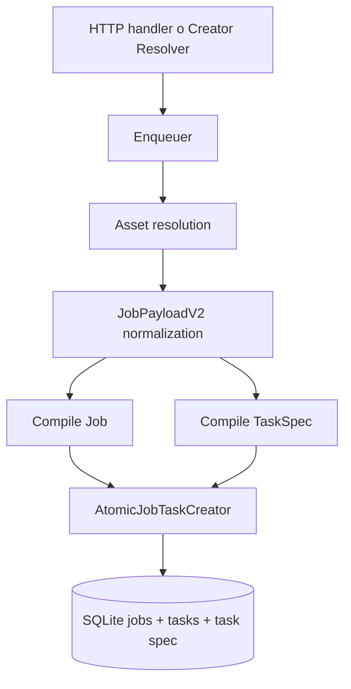
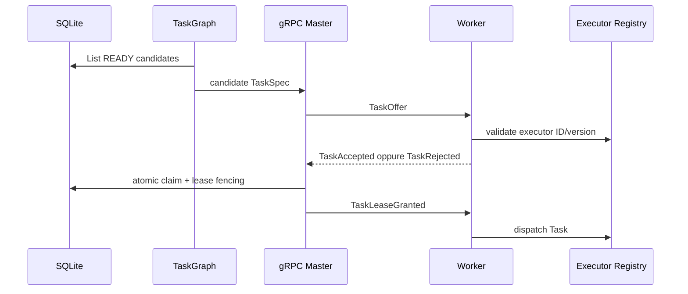
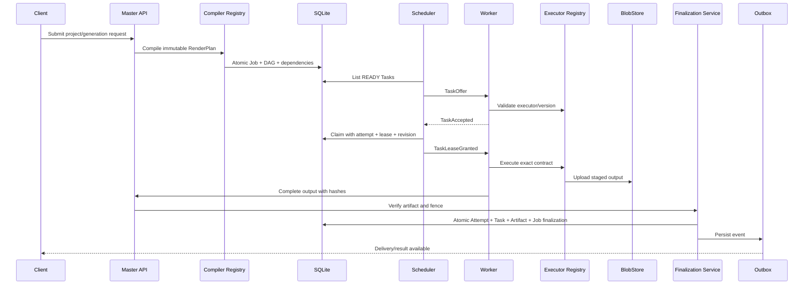

# Velox — Architettura attuale, architettura target e piano di stabilizzazione

**Stato:** documento architetturale di raccordo  
**Repository:** `Marcuss-ops/VeloxEditiingg`  
**Branch di riferimento:** `main`  
**Ultima riconciliazione statica:** 3 luglio 2026  
**Ambito:** master `DataServer`, worker `RemoteCodex`, contratti `shared`, persistenza, artifact, forwarding, supervisor, CI e percorso verso il rendering distribuito

> Questo documento spiega come Velox funziona oggi, quale architettura deve raggiungere, quali invarianti devono essere garantite e quali gap restano aperti. Non sostituisce i cinque documenti canonici in `docs/100-percent-plan/`: li collega allo stato osservabile della codebase corrente.
>
> Una funzionalità è considerata completata soltanto quando esistono codice su `main`, test verdi ed evidenza riproducibile. Commenti, checklist o workflow presenti nel repository non costituiscono da soli prova di completamento.

---

## 1. Sintesi esecutiva

Velox ha già superato la fase di prototipo monolitico. La codebase corrente contiene:

- master Go con HTTP e gRPC;
- worker Go con executor registry;
- motore C++/FFmpeg;
- stato Job, Task e TaskAttempt persistente;
- creazione atomica Job+Task;
- protocollo Task-native;
- forwarding creator persistente;
- completion protocol con fencing e HMAC;
- artifact, outbox e delivery;
- supervisor con classi di criticità;
- doctor e bootstrap worker;
- cost model master-side;
- cache e blob store worker.

La direzione è corretta. Il sistema, però, non può ancora essere considerato completamente stabilizzato o production-certified.

I gap principali sono:

1. dimostrare una clean baseline completa e required;
2. eliminare ogni false-success nei runner;
3. rendere supervisor e readiness realmente fail-closed;
4. chiudere failure window di forwarding, upload e completion;
5. dimostrare il percorso reale master→worker→artifact→Job con E2E obbligatorio;
6. completare recovery, mTLS, certificazione e soak;
7. trasformare il percorso video da `1 Job → 1 Task monolitico` a `1 Job → RenderPlan → Task DAG`.

La priorità non è aggiungere nuovi layer. La priorità è rendere affidabili, osservabili e recuperabili quelli esistenti.

---

## 2. Obiettivo del sistema

Velox deve essere un runtime **headless, deterministico, server-side e CPU-first** per generare e comporre video tramite un master centrale e worker remoti.

Architettura finale:

```text
Richiesta utente
    ↓
Compiler Registry sul master
    ↓
RenderPlan immutabile e versionato
    ↓
Job persistente
    ↓
Task DAG persistente
    ↓
Scheduler e placement
    ↓
Worker compatibile
    ↓
Executor Registry
    ↓
Motore C++/FFmpeg
    ↓
Artifact intermedi/finali verificati
    ↓
Finalizzazione atomica
    ↓
Outbox e delivery
    ↓
Job SUCCEEDED
```

Velox non deve diventare:

- un editor grafico;
- un renderer browser-based;
- un clone di Premiere, After Effects o Blender;
- un runtime dipendente da GPU;
- una collezione di endpoint con percorsi di esecuzione paralleli;
- un insieme di servizi che scrivono lo stesso stato da punti differenti.

Principio fondamentale:

> **Un solo contratto di esecuzione, un solo proprietario per ogni stato, un solo percorso di mutazione.**

---

## 3. Fonti canoniche e ordine di autorità

Fonti architetturali correnti:

- `README.md` — struttura del repository;
- `docs/architecture/OWNERSHIP.md` — owner e writer canonici;
- `docs/100-percent-plan/00-TARGET-AND-DEFINITION-OF-DONE.md`;
- `docs/100-percent-plan/01-RUNTIME-CONSISTENCY-AND-RECOVERY.md`;
- `docs/100-percent-plan/02-CI-TESTING-AND-RELEASE.md`;
- `docs/100-percent-plan/03-PRODUCTION-OPERATIONS-AND-SECURITY.md`;
- `docs/100-percent-plan/04-DISTRIBUTED-RENDERING-PERFORMANCE-AND-SCALE.md`;
- codice e migrazioni presenti su `main`.

Ordine di autorità in caso di divergenza:

1. schema e vincoli realmente applicati;
2. codice di produzione raggiungibile dal composition root;
3. test di invariante e integrazione;
4. documentazione canonica;
5. commenti e documenti storici.

Se un documento afferma che esiste un solo writer ma il codice permette due mutation path indipendenti, lo stato reale è non conforme fino alla convergenza.

---

## 4. Principi architetturali non negoziabili

### 4.1 Single source of truth

| Tipo di dato | Fonte autoritativa |
|---|---|
| Job, Task, TaskAttempt, lease, forwarding, upload, artifact, outbox e delivery | SQLite tramite repository |
| Video, audio, immagini e blob pesanti | BlobStore/filesystem |
| Configurazione e secret | config validata, env e secret store approvati |
| Cache worker | persistente ma ricostruibile |
| Stato in memoria | proiezione o cache, mai autorità business |
| Versione prodotto | `VERSION.txt` |

Sono vietati:

- JSON locali usati come stato business;
- mappe globali usate come coda autoritativa;
- dual-write tra colonne canoniche e copie JSON mutabili;
- fallback silenziosi verso storage alternativi;
- più percorsi impliciti per il database;
- blob pesanti salvati dentro SQLite.

### 4.2 Single writer

Ogni stato importante deve avere:

- un owner;
- un writer;
- una API di mutazione;
- una tabella di transizioni;
- test di invariante full-tree.

Forma obbligatoria:

```text
HTTP/gRPC
    ↓
Application Service
    ↓
Repository / Unit of Work
    ↓
SQLite / BlobStore
```

Forma vietata:

```text
Handler ───────────────► SQL
Background runner ─────► SQL non posseduto
Service A ─────────────► JSON
Service B ─────────────► la stessa riga
Worker ────────────────► reinventa lo stato master
```

### 4.3 Registry-first

Nuove capacità devono entrare in un registry, resolver, compiler, estimator o sampler comune.

Sono vietati switch paralleli quando esiste già un registry:

```go
switch videoMode { ... }
switch executorID { ... }
if provider == "x" { ... }
```

### 4.4 Fail-closed

Una dipendenza obbligatoria mancante deve:

- impedire il bootstrap; oppure
- rendere readiness falsa; oppure
- produrre un errore tipizzato.

Non deve produrre:

- successo apparente;
- `nil` interpretato come successo per un loop permanente;
- registry vuoto;
- probe placeholder verde;
- downgrade automatico a un percorso legacy;
- log di successo senza commit persistente.

### 4.5 Idempotenza e fencing

Ogni operazione ripetibile deve restare corretta dopo:

- retry di rete;
- crash del master;
- crash del worker;
- replay gRPC;
- lease scaduta;
- esecuzione concorrente;
- riordino dei messaggi.

Identità minima di un’esecuzione Task:

```text
task_id
attempt_id
worker_id
lease_id
revision
attempt_number, dove previsto
```

Un report non può modificare lo stato se la tupla non corrisponde al tentativo vincente corrente.

---

## 5. Struttura attuale del repository

```text
DataServer/
    cmd/server/                 Composition root master
    internal/jobs/             Job model e lifecycle
    internal/taskgraph/        Task DAG, readiness, lease e revision
    internal/taskattempts/     Tentativi, report e metriche
    internal/grpcserver/       Control plane worker Task-native
    internal/ingest/           Ingestion dei TaskResult
    internal/artifacts/        Upload, verifica e finalizzazione
    internal/completion/       Protocollo di commit degli output
    internal/creatorflow/      Conversione risultati creator in Job Velox
    internal/forwarding/       Polling persistente creator_forwardings
    internal/outbox/           Eventi durabili
    internal/deliveries/       Delivery provider e retry
    internal/store/            SQLite, migrazioni, adapter e BlobStore
    internal/costmodel/        Eligibility e scoring master-side
    internal/registry/         Capability readiness
    internal/metrics/          Metriche runtime e costi
    internal/workers/          Sessione, heartbeat e comandi worker

RemoteCodex/native/worker-agent-go/
    cmd/velox-worker-agent/    Composition root worker
    internal/executor/         Registry degli executor
    internal/taskrunner/       Dispatch Task per executor
    internal/worker/           Stream, heartbeat e runtime
    internal/telemetry/        Stato risorse e readiness
    pkg/video/pipeline/        Pipeline verso engine nativo
    pkg/cache/                 Cache locale persistente
    pkg/blob/                  Artifact blob content-addressed
    pkg/doctor/                Validazioni operatore

RemoteCodex/native/video-engine-cpp/
    engine C++/FFmpeg

shared/
    contratti Go, protobuf, payload e identità condivise
```

La separazione generale è corretta. I problemi principali non derivano dall’assenza totale di moduli, ma dalla necessità di far convergere tutti i percorsi sugli stessi owner e di provare la correttezza nei failure window.

---

# PARTE I — COME FUNZIONA OGGI

## 6. Ingresso e compilazione Job

Il percorso video usa `shared/contract.JobPayloadV2`.

L’Enqueuer:

1. riceve il payload da un handler HTTP o dal creator resolver;
2. risolve voiceover e scene image;
3. normalizza il payload;
4. rimuove alias legacy dalle scritture canoniche;
5. determina identità e metadati;
6. compila `jobs.Job`;
7. compila `taskgraph.TaskSpec`;
8. delega a `AtomicJobTaskCreator`;
9. inserisce Job e primo Task nella stessa transazione.



### Identità normale

Per richieste normali il Job può ricevere un UUID.

### Identità forwarding

Per risultati provenienti da creatorflow:

```text
source_provider
source_job_id
target_executor_id
        ↓
routing.FormatForwardingKey
        ↓
enqueue.DeriveForwardingJobID
```

Webhook duplicati, poller concorrenti e retry post-crash convergono sullo stesso Job.

### Limite corrente

Il percorso video principale è ancora sostanzialmente:

```text
1 Job → 1 Task scene.composite.v1@1
```

Il Task contiene un payload completo che il worker tratta come composizione monolitica. TaskGraph esiste, ma il video standard non è ancora compilato in un vero DAG di Task granulari.

---

## 7. Job, Task e TaskAttempt

### Job

Rappresenta il risultato business richiesto dall’utente.

Stati essenziali:

```text
PENDING
RUNNING
RETRY_WAIT
SUCCEEDED
FAILED
CANCELLED
```

Il Job non deve possedere lease o worker assignment.

### Task

Rappresenta una unità schedulabile e possiede:

- dipendenze;
- stato READY/LEASED/RUNNING/terminal;
- executor ID/version;
- requisiti;
- attempt number;
- revision;
- worker e lease correnti.

### TaskAttempt

Rappresenta un’esecuzione concreta e possiede:

- worker;
- lease;
- risultato;
- metriche;
- timing di fase;
- output;
- motivo tipizzato;
- identità del tentativo vincente.

### Stato attuale

La codebase è migrata verso un modello Task-native:

- i vecchi messaggi Job del protocollo sono rimossi;
- il worker riceve TaskOffer e TaskLeaseGranted;
- i TaskResult sono tipizzati;
- l’ingestion service centralizza la chiusura del tentativo;
- metriche tipizzate e artifact registration sono collegate all’ingestion.

Resta obbligatorio mantenere test full-tree che impediscano nuove mutation laterali.

---

## 8. Placement e dispatch

Il master possiede il cost model.



Il worker non deve selezionare il lavoro tramite switch paralleli. Deve usare il registry.

Il composition root worker oggi:

- costruisce `executor.Registry`;
- costruisce il pipeline runner;
- esegue bootstrap fail-closed del motore C++ e di FFmpeg;
- registra `scene.composite.v1@1`;
- costruisce cache persistente e blob store;
- passa registry, cache e blob al runtime.

Questa è una base corretta.

Gap:

- catalogo executor reale ristretto;
- la pipeline completa passa principalmente da scene composite;
- cost, locality e multi-executor DAG non sono ancora dimostrati E2E;
- la certificazione per hardware class non è chiusa.

---

## 9. Esecuzione worker

```text
TaskLeaseGranted
    ↓
TaskRunner
    ↓
ExecutorRegistry.Resolve(executor_id, version)
    ↓
SceneComposite executor
    ↓
pipeline.Runner
    ↓
video engine C++ / FFmpeg
    ↓
output e metriche
    ↓
TaskResult tipizzato
```

Il worker deve:

- eseguire, non pianificare;
- rispettare il contratto;
- non inventare Task;
- non cambiare il DAG;
- non scegliere un executor alternativo;
- non dichiarare il Job riuscito;
- produrre hash, size, metadati e metriche.

Cache e blob locali sono ottimizzazioni ricostruibili, non autorità business.

---

## 10. Ingestion del TaskResult

Percorso canonico:

```text
gRPC handler
    ↓
TaskReportIngestionService
    ↓
transazione atomica:
    - chiusura TaskAttempt
    - aggiornamento Task
    - metriche tipizzate
    - cache/cost evidence
    - registrazione output
    ↓
completion/finalization
```

L’handler deve soltanto:

- validare protocollo e identità;
- tradurre gli errori in status gRPC;
- delegare al servizio.

Non deve ricreare la sequenza con SQL o repository separati.

---

## 11. Artifact e completion protocol

### DeclareOutputs

Il master:

- valida la FenceTuple;
- crea o riusa `attempt_commit`;
- genera un commit token deterministico HMAC;
- registra le dichiarazioni output;
- restituisce UploadPlan.

### RecordUploadProgress

Aggiorna:

- `last_progress_at`;
- deadline del commit;
- byte caricati.

Gap osservato: il contratto dichiara progress monotono, mentre la mutation corrente assegna il valore ricevuto. Un heartbeat vecchio può regredire `uploaded_bytes`.

Target SQL:

```sql
SET uploaded_bytes = MAX(uploaded_bytes, ?)
```

### CompleteUpload

Verifica:

- stato upload;
- hash worker;
- hash server-side;
- stato artifact;
- conteggio output ready.

Un artifact può diventare READY solo dopo verifica sufficiente.

### CommitAttempt

La transazione finale:

- marca TaskAttempt;
- marca Task;
- marca il commit COMMITTED;
- effettua il roll-up Job secondo il contratto canonico;
- crea delivery;
- inserisce outbox;
- legge CommitResult prima del commit SQL.

### Confine di ownership corrente

Il gate `TestSucceededWriterIsFinalizationOnly` è stato promosso a must-pass e ora passa.

`internal/completion/sqlite_uow.go` è considerato il gateway SQL autorizzato del Coordinator, nella stessa transazione atomica, non un writer business laterale.

La regola da preservare è:

- `artifacts.FinalizeVerified` governa la finalizzazione artifact/job del percorso artifact;
- `Coordinator.CommitAttempt` governa attempt/task/commit e il relativo roll-up atomico;
- nessun handler o runner può aggiungere un terzo percorso;
- nessun Job può diventare SUCCEEDED prima dell’evidenza artifact richiesta.

Resta utile rendere questa distinzione esplicita in ownership e nei test E2E, così l’allowlist del UoW non venga interpretata come permesso per nuovi writer.

---

## 12. Creatorflow e forwarding

Il polling volatile in goroutine è stato sostituito da `creator_forwardings` persistente.

Stati concettuali:

```text
PENDING
POLLING
RETRY_WAIT
READY_TO_FORWARD
FORWARDING
FORWARDED
BLOCKED
FAILED
```

### Runner

`CreatorForwardingRunner`:

1. reclama righe;
2. assegna lease;
3. avvia renewal;
4. interroga il creator remoto;
5. persiste failure, retry o risultato;
6. delega al Resolver;
7. crea Job+Task e marca FORWARDED atomicamente.

### Resolver

`creatorflow.Resolver`:

- verifica completezza;
- calcola forwarding key;
- deriva job ID deterministico;
- normalizza payload;
- riscrive URL quando necessario;
- assicura la forwarding row;
- prepara Job e TaskSpec;
- esegue `AtomicForwardAndEnqueue`.

La convergenza è corretta.

### Failure window ancora aperte

- `processLease` non restituisce errore;
- mutation failure possono essere solo loggate;
- `tick` può restituire `nil` senza transizione persistita;
- metriche possono aumentare prima della conferma DB;
- ClaimBatch può superare Concurrency;
- lease reclamate possono attendere il semaphore senza renewal;
- resolver lazy è condiviso tra goroutine;
- fast path “Job esistente” deve garantire repair della forwarding row.

Possibile falso successo:

```text
log = forwarded/retried/failed
metric = incrementata
SQLite = stato precedente
supervisor = runner sano
```

Questo è P0.

---

## 13. Outbox e delivery

```text
Transazione business
    ↓
outbox_event persistito
    ↓
OutboxDispatcher
    ↓
DeliveryRunner
    ↓
Provider Registry
    ↓
delivery terminale o retry durabile
```

Obblighi:

- replay idempotente;
- nessun evento perso;
- nessuna delivery duplicata;
- errori infrastrutturali propagati;
- retry tipizzati;
- backlog e oldest-age osservabili.

Outbox e delivery sono critical perché il server può restare vivo mentre il business flow è fermo.

---

## 14. Supervisor e readiness

Classi:

- `ClassOneShot`;
- `ClassRestartable`;
- `ClassCritical`.

Stati:

```text
STARTING
RUNNING
BACKING_OFF
STOPPED
FAILED
```

### Gap: uscita nil

Un runner permanente che ritorna `nil` con context attivo viene considerato clean exit.

Target:

```text
err == nil
AND ctx non cancellato
AND class != OneShot
    ↓
ErrUnexpectedExit
    ↓
restart o fail-loud
```

### Gap: supervisorDone

La chiusura inattesa dell’intero supervisor deve terminare `runServer` con errore.

### Gap: MaxRetries

Semantica target:

- Restartable + 0 = nessun retry;
- Critical + 0 = infinito;
- OneShot = nessun retry.

### Gap: transport probe

Il probe `transport` placeholder restituisce sempre `nil`.

Deve essere sostituito da un check reale del TransportRegistry.

### Gap: registration warning

Un errore nel registrare una capability obbligatoria deve fallire il bootstrap, non produrre soltanto warning.

---

## 15. CI corrente

Sono presenti:

- `make verify`;
- workspace tests;
- routing invariants;
- typed metrics must-pass;
- pre-existing test watchlist promossa a must-pass;
- altri gate architetturali e security.

### Stato aggiornato

I quattro test della vecchia watchlist ora passano deterministicamente:

- `TestSucceededWriterIsFinalizationOnly`;
- `TestBeginUpload_WrongAttemptStatus`;
- `TestUploadCompletedVideo_CanonicalPipeline`;
- `TestGenerateWithImages_UsesCreatorStageWhenConfigured`.

Il gap non è più “correggere quei quattro test”. Il gap è:

- rendere il gate required nella branch protection;
- dimostrare una clean `make verify` completa;
- evitare duplicazione di build logic tra workflow;
- rendere CTest e workload E2E obbligatori;
- impedire skip silenziosi;
- pubblicare evidenza di release unica.

Target:

```text
make verify
    ├── formatting
    ├── architecture checks
    ├── migrations
    ├── Go vet/test/race
    ├── C++ configure/build/CTest
    ├── security checks
    ├── real workload E2E
    └── release evidence
```

I workflow devono essere dispatcher sottili.

---

# PARTE II — ARCHITETTURA TARGET

## 16. Flusso end-to-end definitivo



Invariante principale:

```text
Task richiesti terminali e validi
AND winning attempt inequivocabile
AND artifact finale presente
AND hash verificato
AND artifact READY
AND finalizzazione/outbox commit-tati
    ↓
Job SUCCEEDED
```

---

## 17. RenderPlan immutabile

Target:

```text
Endpoint specifico
    ↓
Compiler registrato
    ↓
RenderPlan comune e versionato
    ↓
TaskSpec derivati
    ↓
Executor generici
```

RenderPlan deve includere:

- schema version;
- identità deterministica;
- input canonici;
- timeline e layer;
- asset reference;
- output contract;
- codec, color, frame rate e time base;
- executor e versioni;
- requisiti;
- dipendenze;
- policy determinismo/cache.

Il worker non deve interpretare il progetto grezzo o decidere come dividerlo.

---

## 18. Multi-Task DAG

Esempio target:

```text
Job
 ├── prepare.asset.voiceover
 ├── prepare.asset.images
 ├── render.text
 ├── render.overlay
 ├── render.precomposition.A
 ├── render.precomposition.B
 ├── mix.audio
 ├── compose.scene
 ├── concat.video
 └── encode.final
```

Ogni Task deve avere:

- ID stabile;
- executor ID/version;
- input artifact;
- output atteso;
- requirements;
- dependency edges;
- retry policy;
- determinism/cache policy;
- state machine persistente.

Il DAG deve essere pubblicato atomicamente o restare non eseguibile finché la compilazione non è completa e validata.

---

## 19. Scheduler target

Filtri:

1. executor ID/version;
2. resource class;
3. temporal mode;
4. deterministic requirement;
5. cacheable requirement;
6. slot disponibili;
7. memoria e disco;
8. drain/readiness;
9. banda;
10. locality e cache evidence.

Score:

```text
priority
+ queue age
+ estimated completion time
+ locality
+ bandwidth
+ historical profile
- pressure
- transfer cost
- fairness penalty
```

La decisione deve essere persistita e spiegabile.

---

## 20. Cache e artifact target

### Cache hit valida

- key da input semantici canonici;
- executor/engine version inclusi;
- nessun path macchina o timestamp casuale;
- blob presente;
- hash verificato;
- metadati compatibili.

### Artifact states

```text
DECLARED
STAGING
VERIFYING
READY
QUARANTINED
FAILED
```

Nessun path locale worker diventa output finale senza registrazione master.

### Finalizzazione

Deve restare un solo confine business autorizzato a:

- scegliere il winning attempt;
- verificare output;
- promuovere artifact;
- marcare Task e Job;
- creare outbox/delivery;
- restituire risultato idempotente.

Adapter SQL e Unit of Work sono dettagli interni del medesimo confine, non nuovi owner.

---

## 21. Recovery target

### Master restart

- readiness falsa;
- dipendenze validate;
- runner avviati;
- Task READY riletti;
- lease scadute riconciliate;
- outbox/delivery riprese;
- forwardings ripresi;
- upload/artifact abbandonati riconciliati;
- readiness vera solo dopo probe reali.

### Worker crash

- renewal mancante;
- lease scaduta;
- vecchio attempt stale/terminal;
- un solo nuovo attempt;
- Task READY o FAILED;
- late result rifiutato;
- un solo artifact finale READY.

### Network partition

- nessuna split-brain finalization;
- nuova sessione autenticata;
- replay idempotente;
- lease/revision proteggono il winner;
- reason tipizzati.

---

# PARTE III — GAP ANALYSIS

## 22. Mappa sintetica

| Area | Oggi | Target | Gap |
|---|---|---|---|
| Baseline | watchlist must-pass, vari gate | clean full verification required | branch protection ed evidenza completa |
| Job creation | Job+Task atomici | Job+RenderPlan+DAG atomici | compilazione multi-Task |
| Executor | registry + scene composite | più executor reali | catalogo e contract test |
| Forwarding | persistente/deterministico | zero false-success | error propagation e lease batch |
| Completion | fencing/HMAC/UoW | progress e retry coerenti | monotonicità e budget keyed |
| Finalization | invariant writer test verde | proof E2E artifact-before-job | evidenza failure-window |
| Supervisor | classi/readiness | permanent runner fail-loud | nil exit e supervisorDone |
| Capability | registry presente | probe reali | transport placeholder |
| CI | più must-pass gate | make verify canonico | required E2E/CTest e dedupe |
| Recovery | componenti presenti | suite automatizzata | failure injection completa |
| Operations | doctor/bootstrap | worker certificato | mTLS, soak, rollout evidence |
| Scale | TaskGraph/costmodel | DAG/locality/sharding | implementazione e benchmark |

---

# PARTE IV — PIANO DI INTERVENTO

## 23. P0-01 — Rendere la baseline realmente obbligatoria

### Stato

I quattro test della watchlist sono verdi e promossi a must-pass.

### Azioni

1. rendere i gate must-pass required nella branch protection;
2. eseguire `make verify-fast` da clean checkout;
3. eseguire `make verify` con Docker e native toolchain;
4. eseguire Go race per tutti i moduli;
5. eseguire CTest e fallire se scopre zero test;
6. verificare architecture, migration, registry, secret e DB-access checks;
7. archiviare summary e durata;
8. impedire neutral/skipped per gate mandatory.

### Accettazione

- zero test noti rossi;
- required checks configurati;
- nessuno skip critico;
- clean verification riproducibile.

---

## 24. P0-02 — Eliminare false-success nel forwarding

### Azioni

1. `processLease` deve restituire `error`;
2. classificare element-scoped, lease-lost e infrastructure;
3. raccogliere errori delle goroutine;
4. propagare errori infrastrutturali da `tick`;
5. incrementare metriche solo dopo CAS riuscito;
6. imporre `effectiveClaimBatch <= Concurrency`;
7. non reclamare lavoro che non può iniziare;
8. iniettare Resolver nel costruttore;
9. eliminare lazy init concorrente;
10. riparare forwarding row nel fast path idempotente;
11. aggiungere failure injection DB.

### Accettazione

- nessun log forwarded senza FORWARDED;
- nessuna metrica terminale senza persistenza;
- DB outage scala al supervisor;
- nessuna lease scade in attesa del semaphore;
- retry converge sullo stesso Job.

---

## 25. P0-03 — Correggere supervisor e readiness

### Azioni

1. introdurre `ErrUnexpectedExit`;
2. `nil` da runner permanente diventa errore;
3. test Restartable/Critical;
4. correggere `MaxRetries=0`;
5. trattare `supervisorDone` inatteso come fatal;
6. sostituire transport placeholder;
7. registration error diventa bootstrap error;
8. collegare `CapabilityRegistry.Readyz` alla health readiness;
9. timeout breve per probe;
10. testare runner death e recovery.

### Accettazione

- runner permanente non sparisce silenziosamente;
- readiness rossa in backoff/failure;
- transport mancante non risulta ready;
- master non serve ready con supervisor morto.

---

## 26. P0-04 — Correggere progress e conflict budget

### Azioni

1. rendere `uploaded_bytes` monotono;
2. testare sequenza `1000 → 800 → 1200`;
3. allineare soglia documentata e codice;
4. rendere budget keyed per operation+commit o contare solo contention infrastrutturale;
5. evitare streak condivise tra commit indipendenti;
6. reset sulla stessa chiave;
7. metriche per conflict, escalation e reset;
8. oldest unresolved commit.

### Accettazione

- progress non regredisce;
- conflitti indipendenti non si sommano;
- soglia implementata uguale alla documentazione;
- escalation osservabile e supervisionata.

---

## 27. P0-05 — Blindare il confine di finalizzazione

### Stato

Il test single-writer è verde e il UoW completion è autorizzato come gateway interno.

### Azioni

1. documentare esplicitamente artifacts vs completion;
2. cercare tutti i writer SUCCEEDED e completed_at;
3. mantenere allowlist minima e motivata;
4. impedire nuovi writer con invariant scan;
5. verificare che Job non preceda artifact READY;
6. test duplicate finalize;
7. test crash prima/dopo blob promotion;
8. test crash prima/dopo DB commit;
9. test losing attempt.

### Accettazione

- nessun terzo writer;
- Job non SUCCEEDED senza artifact richiesto;
- duplicate finalize idempotente;
- un solo final artifact READY.

---

## 28. P0-06 — Workload E2E reale

Fixture minima:

```text
1 Job
1 Task scene.composite.v1@1
1 worker CPU
1 voiceover o clip
1 scena
1 output H.264
```

Sequenza:

1. master con DB/BlobStore temporanei;
2. worker reale;
3. handshake gRPC v3;
4. registry con scene composite;
5. submit API;
6. TaskOffer;
7. TaskAccepted;
8. TaskLeaseGranted;
9. C++/FFmpeg render;
10. upload;
11. hash server-side;
12. artifact READY;
13. attempt SUCCEEDED;
14. Task SUCCEEDED;
15. Job SUCCEEDED;
16. ffprobe;
17. SHA-256;
18. metriche non zero.

Accettazione:

- nessun renderer mock;
- nessun SQL manuale;
- nessuna transizione saltata;
- output/log/DB snapshot archiviati su failure;
- required per cambi runtime.

---

## 29. P1-01 — Restringere le dipendenze ai confini

Usare interfacce consumer-owned:

```go
type ForwardingRepository interface {
    GetBySource(...)
    Insert(...)
    MarkReady(...)
    AtomicForwardAndEnqueue(...)
}

type JobReader interface {
    Get(context.Context, string) (*jobs.Job, error)
}
```

Non creare un framework DI.

Obiettivi:

- business logic non conosce `*SQLiteStore`;
- fake stretti nei test;
- concrete implementation solo nel composition root;
- niente global singleton o service locator.

---

## 30. P1-02 — Consolidare CI

1. target canonici `make test-go`, `test-native`, `test-architecture`, `test-e2e`, `verify`;
2. workflow matrix con job distinti;
3. setup e logica non duplicati;
4. regex test deve matchare almeno un test;
5. CTest deve scoprire almeno un test;
6. gate corretti required;
7. summary unica;
8. artifact di failure archiviati.

---

## 31. P1-03 — Suite recovery

Automatizzare:

- master crash con READY Task;
- master crash durante finalization;
- worker crash prima/dopo accept;
- crash durante render;
- crash durante upload;
- partition corta/lunga rispetto alla lease;
- duplicate TaskResult;
- stale result;
- due worker in race;
- outbox failure dopo business commit;
- forwarding DB failure;
- SIGTERM e drain.

Ogni test verifica SQLite, BlobStore, metriche e artifact.

---

## 32. P1-04 — Certificazione worker e mTLS

Minimo:

- worker ID stabile;
- certificato dedicato;
- identity-cert mapping;
- no plaintext in staging/prod;
- doctor JSON versionato;
- engine/FFmpeg reali;
- cache/blob/disk writable;
- registry non vuoto;
- canary CPU;
- 24h soak;
- rollout/rollback per digest.

Doctor e bootstrap esistenti sono una base. Il gate finale deve includere sessione master, identity e workload reale.

---

## 33. P2 — RenderPlan, DAG e scala

Questa fase parte dopo i P0 runtime/CI.

Ordine:

1. RenderPlan schema;
2. compiler registry;
3. persistenza plan;
4. multi-Task DAG;
5. executor granulari;
6. intermediate artifact contract;
7. cache key deterministica;
8. late composition;
9. locality scoring;
10. temporal sharding;
11. benchmark CPU;
12. soak distribuito.

Non implementare sharding prima di:

- artifact intermedi deterministici;
- frame/timebase contract;
- concat/mux validation;
- retry per shard;
- confronto sharded/non-sharded.

---

# PARTE V — REGOLE DI IMPLEMENTAZIONE

## 34. Cosa non fare

- Non duplicare owner esistenti.
- Non aggiungere un secondo registry.
- Non aggiungere switch executor accanto al registry.
- Non aggiungere fallback legacy per far passare test.
- Non aggiungere write API di compatibilità.
- Non usare log come sostituto della persistenza.
- Non incrementare metriche prima del commit.
- Non dichiarare ready con probe placeholder.
- Non considerare nil un successo per loop permanenti.
- Non introdurre astrazioni generiche per requisiti futuri.
- Non creare branch o PR per il normale flusso concordato: lavoro e push avvengono direttamente su `main`.

---

## 35. Workflow di modifica sicuro

1. identificare owner;
2. scrivere test che dimostra il bug;
3. cambiare una responsabilità;
4. evitare refactor laterali;
5. eseguire test targeted;
6. eseguire `make verify`;
7. controllare diff e stato;
8. push su `main`;
9. verificare commit remoto e ultimi cinque commit;
10. aggiornare checklist solo con evidenza.

---

## 36. Metriche minime

### Master

- READY/LEASED/RUNNING Task;
- lease expiry;
- stale/duplicate report;
- forwarding queue depth e oldest age;
- forwarding transition failure;
- unreconciled terminal Task;
- outbox pending e oldest;
- delivery retry/failure;
- upload verifying/stuck;
- artifact quarantine;
- conflict budget per key;
- runner state/restart.

### Worker

- session active;
- heartbeat age;
- active Task e slot;
- CPU/RSS/disk/temp;
- cache hit bytes;
- blob bytes;
- render/upload time;
- FFmpeg reason;
- executor rejection;
- certificate lifetime.

### Progetto

- wall-clock;
- critical path;
- worker busy time;
- parallel efficiency;
- cache ratio;
- retry/straggler;
- cost per output minute.

---

## 37. Definition of Done finale

```text
Clean checkout verification = PASS
Go unit/race = PASS
C++ CTest = PASS
Architecture invariants = PASS
Real gRPC workload = PASS
Production-like mTLS workload = PASS

Job = SUCCEEDED
Required Tasks = SUCCEEDED
Winning Attempts = SUCCEEDED
Final Artifact = READY
Final SHA-256 = verified
ffprobe contract = PASS

Master restart = recovered
Worker crash = recovered
Network partition = recovered
Drain/SIGTERM = clean

Lost Jobs = 0
Duplicate READY final artifacts = 0
Orphan terminal Tasks = 0
False-success transitions = 0
Production fallback count = 0

24-hour soak = PASS
Staging and production digest = identical
Rollback by digest = PASS
```

---

## 38. Stato sintetico

### Già presente e nella direzione corretta

- master/worker separati;
- gRPC Task-native;
- Job+Task atomici;
- TaskGraph/TaskAttempt persistenti;
- payload V2;
- executor registry;
- scene composite reale;
- cache/blob worker;
- forwarding persistente;
- job ID deterministico;
- Resolver comune;
- completion protocol;
- HMAC/fencing;
- outbox/delivery;
- supervisor;
- readiness framework;
- doctor/bootstrap;
- cost model master-side;
- watchlist tests promossi a must-pass.

### Parzialmente stabilizzato

- propagation errori runner;
- retry/conflict budget;
- capability readiness;
- recovery automatica;
- CI required checks;
- E2E reale;
- mTLS production-like;
- worker certification;
- metriche complete;
- proof artifact-before-job su tutte le failure window.

### Ancora target

- RenderPlan unico persistito;
- compiler registry completo;
- multi-Task DAG video;
- executor granulari;
- late composition;
- cache distribuita verificata;
- locality-aware scheduling;
- temporal sharding;
- critical path/parallel efficiency;
- soak distribuito certificato.

---

## 39. Conclusione

Velox non necessita di una riscrittura totale.

Il rischio principale è nella distanza tra:

```text
“il codice ha tentato l’operazione”
```

e:

```text
“la transizione è stata persistita,
verificata, osservabile e recuperabile dopo crash”
```

Ordine corretto:

1. rendere obbligatoria la baseline verde;
2. eliminare false-success;
3. blindare supervisor/readiness;
4. correggere retry/progress;
5. provare finalizzazione e artifact;
6. dimostrare E2E;
7. chiudere recovery e certificazione;
8. solo dopo espandere Job in DAG distribuito.

> **Ogni nuova capacità estende il percorso canonico esistente; non ne crea uno parallelo.**
