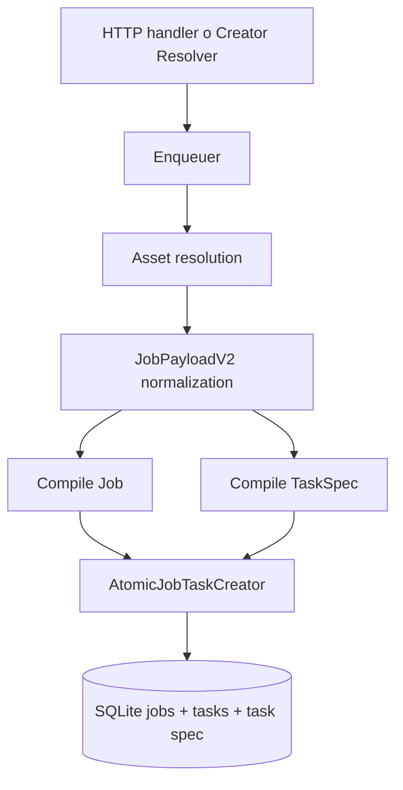
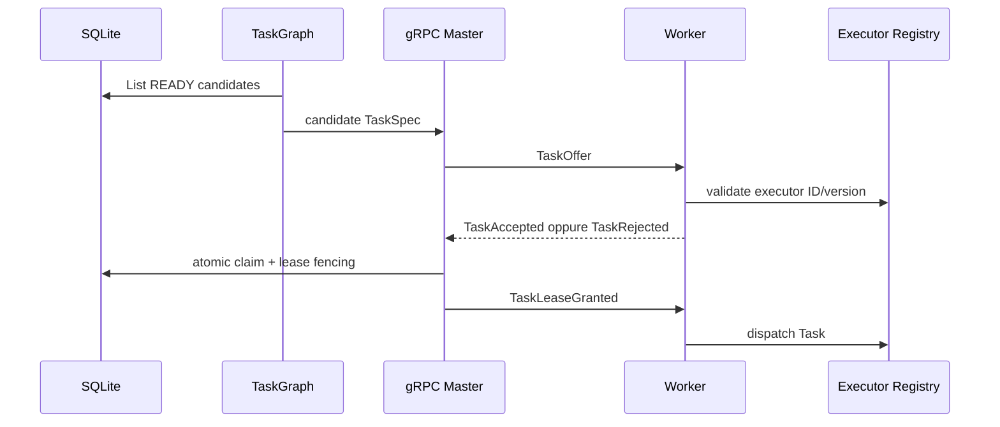
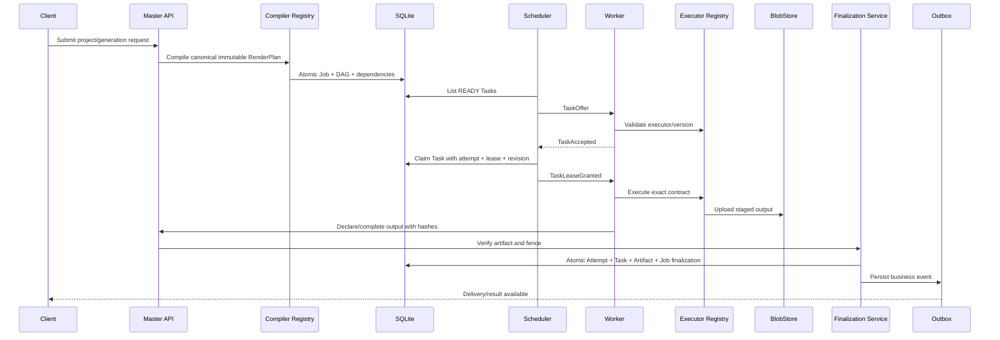

# Velox — Architettura attuale, architettura target e piano di stabilizzazione

**Stato:** documento architetturale di raccordo  
**Repository:** `Marcuss-ops/VeloxEditiingg`  
**Branch di riferimento:** `main`  
**Ultima riconciliazione statica:** 3 luglio 2026  
**Ambito:** master `DataServer`, worker `RemoteCodex`, contratti `shared`, persistenza, artifact, forwarding, supervisor, CI e percorso verso il rendering distribuito

> Questo documento descrive come Velox funziona oggi, quale architettura deve raggiungere, quali invarianti devono essere garantite e quali gap restano aperti. Non sostituisce i cinque documenti canonici in `docs/100-percent-plan/`: li collega allo stato osservabile della codebase corrente.
>
> Una funzionalità è indicata come completata solo quando esistono codice su `main`, test verdi ed evidenza riproducibile. Commenti, checklist o workflow presenti nel repository non costituiscono da soli prova di completamento.

---

## 1. Obiettivo del sistema

Velox deve essere un runtime **headless, deterministico, server-side e CPU-first** per generare e comporre video tramite un master centrale e worker remoti.

Il risultato finale desiderato è il seguente:

```text
Richiesta utente
    ↓
Compilatore master
    ↓
RenderPlan immutabile e versionato
    ↓
Job persistente
    ↓
Task DAG persistente
    ↓
Placement su worker compatibili
    ↓
Esecuzione tramite executor registry
    ↓
Artifact intermedi e finali verificati
    ↓
Finalizzazione atomica
    ↓
Job SUCCEEDED
```

Il sistema non deve diventare:

- un editor grafico;
- un renderer browser-based;
- un clone di Premiere, After Effects o Blender;
- un sistema dipendente da GPU;
- una collezione di endpoint che avviano percorsi di esecuzione differenti e non riconciliabili.

Il principio fondamentale è:

> **Un solo contratto di esecuzione, un solo proprietario per ogni stato, un solo percorso di mutazione.**

---

## 2. Fonti canoniche e regole di autorità

Le fonti architetturali correnti sono:

- `README.md` per la struttura del repository;
- `docs/architecture/OWNERSHIP.md` per owner e writer canonici;
- `docs/100-percent-plan/00-TARGET-AND-DEFINITION-OF-DONE.md`;
- `docs/100-percent-plan/01-RUNTIME-CONSISTENCY-AND-RECOVERY.md`;
- `docs/100-percent-plan/02-CI-TESTING-AND-RELEASE.md`;
- `docs/100-percent-plan/03-PRODUCTION-OPERATIONS-AND-SECURITY.md`;
- `docs/100-percent-plan/04-DISTRIBUTED-RENDERING-PERFORMANCE-AND-SCALE.md`;
- codice e migrazioni presenti su `main`.

Ordine di autorità in caso di divergenza:

1. schema e vincoli realmente applicati;
2. codice di produzione raggiungibile dal composition root;
3. test di invariante e integrazione;
4. documentazione canonica;
5. commenti e documenti storici.

Se un documento afferma che esiste un solo writer ma il codice permette due mutation path, lo stato reale è **non conforme** finché il secondo percorso non viene eliminato o ricondotto al writer canonico.

---

## 3. Principi architetturali non negoziabili

### 3.1 Single source of truth

| Tipo di dato | Fonte autoritativa |
|---|---|
| Job, Task, TaskAttempt, lease, forwarding, upload, artifact, outbox e delivery | SQLite tramite repository |
| File video, audio, immagini e blob pesanti | BlobStore/filesystem |
| Configurazione e secret | config validata, env e secret store approvati |
| Cache worker | persistente ma ricostruibile, mai fonte business autoritativa |
| Stato in memoria | solo proiezione o cache ricostruibile |
| Versione prodotto | `VERSION.txt` |

Sono vietati:

- JSON locali usati come stato business;
- mappe globali usate come coda autoritativa;
- dual-write tra colonne canoniche e copie JSON mutabili;
- fallback silenziosi verso storage alternativi;
- percorsi DB scelti implicitamente in directory differenti.

### 3.2 Single writer

Ogni stato importante deve avere:

- un owner;
- un writer;
- una API di mutazione;
- un set di transizioni consentite;
- test che impediscano la comparsa di un secondo writer.

Forma obbligatoria:

```text
HTTP/gRPC
    ↓
Application Service
    ↓
Repository / Unit of Work
    ↓
SQLite / BlobStore
```

Forma vietata:

```text
Handler ───────────────► SQL
Background runner ─────► SQL non posseduto
Service A ─────────────► JSON
Service B ─────────────► la stessa riga
Worker ────────────────► reinventa lo stato master
```

### 3.3 Registry-first

Nuove capacità devono entrare in un registry, resolver, compiler, estimator o sampler comune.

È vietato aggiungere la stessa selezione in più punti:

```go
switch videoMode { ... }
switch executorID { ... }
if provider == "x" { ... }
```

quando esiste già un registry canonico.

### 3.4 Fail-closed

Una dipendenza obbligatoria mancante deve:

- impedire il bootstrap; oppure
- rendere readiness falsa; oppure
- restituire un errore tipizzato.

Non deve mai produrre:

- successo apparente;
- `nil` usato come “va bene”;
- registry vuoto;
- probe placeholder verde;
- downgrade automatico a un percorso legacy.

### 3.5 Idempotenza e fencing

Ogni operazione ripetibile deve essere sicura dopo:

- retry di rete;
- crash del master;
- crash del worker;
- replay gRPC;
- lease scaduta;
- esecuzione concorrente.

L’identità minima di un’esecuzione Task è:

```text
task_id
attempt_id
worker_id
lease_id
revision
attempt_number, dove previsto dal protocollo
```

Un report non deve poter modificare lo stato se la tupla non corrisponde al tentativo vincente corrente.

---

## 4. Struttura attuale del repository

```text
DataServer/
    cmd/server/                 Composition root master
    internal/jobs/             Job model e lifecycle
    internal/taskgraph/        Task DAG, readiness, lease e revision
    internal/taskattempts/     Tentativi, report e metriche
    internal/grpcserver/       Control plane worker Task-native
    internal/ingest/           Ingestion dei TaskResult
    internal/artifacts/        Upload, verifica e finalizzazione
    internal/completion/       Protocollo di commit degli output
    internal/creatorflow/      Conversione risultati creator in Job Velox
    internal/forwarding/       Polling persistente creator_forwardings
    internal/outbox/           Eventi durabili
    internal/deliveries/       Delivery provider e retry
    internal/store/            SQLite, migrazioni, adapter e BlobStore
    internal/costmodel/        Eligibility e scoring master-side
    internal/registry/         Capability readiness
    internal/metrics/          Metriche runtime e costi
    internal/workers/          Sessione, heartbeat e comandi worker

RemoteCodex/native/worker-agent-go/
    cmd/velox-worker-agent/    Composition root worker
    internal/executor/         Registry degli executor
    internal/taskrunner/       Dispatch Task per executor
    internal/worker/           Stream, heartbeat e runtime
    internal/telemetry/        Stato risorse e readiness
    pkg/video/pipeline/        Pipeline verso engine nativo
    pkg/cache/                 Cache locale persistente
    pkg/blob/                  Artifact blob content-addressed
    pkg/doctor/                Validazioni operatore

RemoteCodex/native/video-engine-cpp/
    engine C++/FFmpeg

shared/
    contratti Go, protobuf, payload e identità condivise
```

La divisione generale è corretta: master, worker, contratti e motore nativo hanno responsabilità distinguibili. I principali gap non derivano dalla mancanza totale di moduli, ma dalla necessità di far convergere tutti i percorsi sugli stessi owner e di dimostrare la correttezza nei failure window.

---

# PARTE I — COME FUNZIONA OGGI

## 5. Ingresso e compilazione Job attuale

### 5.1 Payload canonico

Il percorso video usa il contratto `shared/contract.JobPayloadV2`.

L’Enqueuer:

1. riceve una mappa al bordo HTTP o da creatorflow;
2. risolve gli asset voiceover e scene image;
3. normalizza il payload;
4. rimuove alias legacy dalle scritture canoniche;
5. determina `job_id`, `job_run_id`, `video_name`, scenes e voiceover;
6. compila un `jobs.Job`;
7. compila un `taskgraph.TaskSpec`;
8. chiama l’atomic creator per inserire Job e primo Task nella stessa transazione.

Schema corrente:



### 5.2 Identità

Per richieste normali, il Job può ricevere un UUID.

Per forwarding da un sistema creator remoto, il `job_id` viene derivato deterministicamente dalla forwarding key:

```text
source_provider
source_job_id
target_executor_id
        ↓
routing.FormatForwardingKey
        ↓
enqueue.DeriveForwardingJobID
```

Questo consente a webhook duplicati, poller concorrenti e retry post-crash di convergere sullo stesso Job.

### 5.3 Limite corrente

Il sistema crea atomicamente Job e Task, ma il percorso video principale è ancora sostanzialmente:

```text
1 Job → 1 Task scene.composite.v1@1
```

Il Task contiene un payload ricco che il worker tratta come una composizione video completa. La struttura TaskGraph esiste, ma il vero split in più Task indipendenti non è ancora il percorso operativo completo del video standard.

---

## 6. Stato Job, Task e TaskAttempt

### 6.1 Job

Il Job rappresenta il risultato business richiesto dall’utente.

Stati target essenziali:

```text
PENDING
RUNNING
RETRY_WAIT
SUCCEEDED
FAILED
CANCELLED
```

Il Job non deve essere usato come lease di esecuzione. Lease, attempt e worker assignment appartengono al Task.

### 6.2 Task

Il Task rappresenta una unità schedulabile.

Responsabilità:

- dipendenze;
- stato READY/LEASED/RUNNING/terminal;
- executor ID e versione;
- requisiti;
- attempt number;
- revision;
- worker e lease correnti.

### 6.3 TaskAttempt

Il TaskAttempt rappresenta un’esecuzione concreta del Task.

Responsabilità:

- worker che ha eseguito;
- lease;
- risultato;
- metriche;
- timing di fase;
- output prodotti;
- motivo tipizzato di errore o rifiuto;
- identità del tentativo vincente.

### 6.4 Stato attuale

La codebase è stata migrata verso un modello Task-native:

- i vecchi messaggi Job del protocollo sono stati rimossi;
- il worker riceve TaskOffer e TaskLeaseGranted;
- i TaskResult sono tipizzati;
- l’ingestion service centralizza la chiusura del tentativo;
- metriche tipizzate e artifact registration sono collegate all’ingestion.

Resta necessario dimostrare che nessun percorso legacy o secondario aggiorni Job, Task o attempt fuori dai repository canonici.

---

## 7. Placement e dispatch attuali

Il master possiede il cost model.

Flusso previsto oggi:



Il worker non deve selezionare autonomamente il tipo di lavoro tramite switch paralleli. Deve usare il registry degli executor.

Attualmente il composition root worker:

- costruisce `executor.Registry`;
- costruisce il pipeline runner;
- esegue un bootstrap fail-closed del motore C++ e di FFmpeg;
- registra `scene.composite.v1@1`;
- costruisce cache persistente e blob store locali;
- passa registry, cache e blob al worker runtime.

Questa è una buona base.

Gap corrente:

- il catalogo reale degli executor è ancora ristretto;
- la maggior parte della pipeline completa passa da `scene.composite.v1@1`;
- il placement non ha ancora dimostrato end-to-end cost, locality e multi-executor DAG;
- la certificazione worker non è ancora chiusa per ogni hardware class.

---

## 8. Esecuzione worker attuale

Il worker riceve un contratto Task dal master.

Flusso:

```text
TaskLeaseGranted
    ↓
TaskRunner
    ↓
ExecutorRegistry.Resolve(executor_id, version)
    ↓
SceneComposite executor
    ↓
pipeline.Runner
    ↓
video engine C++ / FFmpeg
    ↓
output e metriche
    ↓
TaskResult tipizzato
```

Il worker deve:

- eseguire, non pianificare;
- rispettare il payload ricevuto;
- non inventare Task;
- non cambiare il DAG;
- non scegliere un altro executor;
- non dichiarare il Job riuscito;
- produrre hash, size, metadati e metriche.

La cache locale e il blob store worker sono ottimizzazioni ricostruibili. Non possono sostituire la registrazione artifact del master.

---

## 9. Ingestion del TaskResult

Il control plane master riceve un `TaskResult` tipizzato.

Il percorso desiderato, in gran parte già introdotto, è:

```text
gRPC handler
    ↓
TaskReportIngestionService
    ↓
transazione atomica:
    - chiusura TaskAttempt
    - aggiornamento Task
    - persistenza metriche tipizzate
    - cache/cost evidence
    - registrazione output
    ↓
successivo roll-up Job e artifact completion
```

L’handler deve limitarsi a:

- validare protocollo e identità;
- tradurre errori in status gRPC;
- delegare al servizio.

Non deve ricostruire la stessa sequenza con SQL o repository separati.

---

## 10. Protocollo artifact e completion attuale

La codebase contiene un protocollo esplicito di commit output.

### 10.1 DeclareOutputs

Il worker dichiara gli output attesi.

Il master:

- valida la FenceTuple;
- crea o riusa un `attempt_commit`;
- genera un commit token deterministico con HMAC;
- registra le dichiarazioni output;
- restituisce un UploadPlan.

### 10.2 Upload progress

Il worker invia progressi per un upload.

Il master aggiorna:

- `last_progress_at`;
- deadline del commit;
- byte caricati.

Gap osservato: la documentazione promette monotonicità di `uploaded_bytes`, ma la mutation corrente assegna il valore ricevuto. Un heartbeat vecchio può quindi regredire il progresso. La query deve usare una semantica `MAX(existing, incoming)`.

### 10.3 CompleteUpload

Il master verifica:

- stato upload;
- hash dichiarato dal worker;
- hash verificato server-side;
- stato artifact;
- conteggio degli output pronti.

Un artifact può diventare READY solo quando la verifica server-side è sufficiente.

### 10.4 CommitAttempt

La transazione finale:

- marca il TaskAttempt riuscito;
- marca il Task riuscito;
- marca il commit come COMMITTED;
- aggiorna il Job quando le condizioni sono soddisfatte;
- crea delivery;
- inserisce evento outbox;
- legge il CommitResult prima del commit SQL.

### 10.5 Ambiguità da chiudere

`docs/architecture/OWNERSHIP.md` assegna la scrittura esclusiva di Job `SUCCEEDED` ad `internal/artifacts.Service`.

Il completion coordinator contiene però un percorso che invoca la finalizzazione Job tramite il repository quando i Task sono terminati.

Questa divergenza deve essere risolta esplicitamente:

- o il coordinator delega all’unico finalizer artifact;
- oppure la ownership canonica viene ridefinita attorno a un `FinalizationService` unico;
- non sono consentiti due writer semanticamente equivalenti.

Il test `TestSucceededWriterIsFinalizationOnly`, oggi nella watchlist dei test noti come fallenti, è il segnale che questo contratto non è ancora stabilizzato.

---

## 11. Creatorflow e forwarding attuali

Velox può ricevere risultati da un creator engine remoto.

### 11.1 Stato persistente

Il vecchio polling in goroutine non persistente è stato sostituito da `creator_forwardings`.

Stati concettuali:

```text
PENDING
POLLING
RETRY_WAIT
READY_TO_FORWARD
FORWARDING
FORWARDED
BLOCKED
FAILED
```

### 11.2 Runner

`CreatorForwardingRunner`:

1. reclama righe PENDING/RETRY_WAIT;
2. assegna lease;
3. avvia renewal;
4. interroga il creator remoto;
5. persiste failure, retry o risultato;
6. delega al Resolver;
7. crea Job+Task e marca FORWARDED atomicamente.

### 11.3 Resolver

`creatorflow.Resolver` è il punto canonico per convertire un risultato creator completo in Job Velox.

Responsabilità:

- verificare completezza;
- calcolare forwarding key;
- derivare job ID deterministico;
- normalizzare payload;
- riscrivere URL quando necessario;
- assicurare la forwarding row;
- preparare Job e TaskSpec;
- eseguire `AtomicForwardAndEnqueue`.

Questa convergenza è corretta.

### 11.4 Gap di affidabilità

Il runner attuale ha ancora failure window che possono risultare verdi:

- `processLease` non restituisce errore;
- molte mutation failure vengono solo loggate;
- `tick` può restituire `nil` anche quando la riga non è stata aggiornata;
- metriche `Failed` o `Retried` possono aumentare anche se la transizione DB è fallita;
- il claim batch può essere maggiore della concurrency, quindi lease già reclamate aspettano il semaphore senza renewal;
- il resolver lazy è scritto da goroutine concorrenti senza una chiara sincronizzazione;
- il fast path “Job già esistente” non garantisce sempre che la forwarding row sia stata riparata e marcata FORWARDED.

Conseguenza possibile:

```text
log = forwarded/retried/failed
metric = incrementata
SQLite = stato precedente o lease scaduta
supervisor = runner sano
```

Questa classe di falso successo è P0.

---

## 12. Outbox e delivery attuali

Il modello corretto è:

```text
Transazione business
    ↓
outbox_event persistito nella stessa unità atomica
    ↓
OutboxDispatcher
    ↓
DeliveryRunner
    ↓
Provider registry
    ↓
delivery terminale o retry durabile
```

Questo impedisce che il Job venga completato ma l’azione esterna venga persa dopo un crash.

I runner di outbox e delivery sono classificati critical perché, se muoiono, il master continua a rispondere ma il flusso business non avanza.

Resta obbligatorio dimostrare:

- replay idempotente;
- nessun evento perso;
- nessuna delivery duplicata;
- errori infrastrutturali propagati al supervisor;
- retry con limite e motivo tipizzato;
- backlog e oldest-age osservabili.

---

## 13. Supervisor e readiness attuali

### 13.1 Classi runner

Il supervisor distingue:

- `ClassOneShot`;
- `ClassRestartable`;
- `ClassCritical`.

Tiene stati:

```text
STARTING
RUNNING
BACKING_OFF
STOPPED
FAILED
```

La readiness controlla i runner non-one-shot e deve diventare rossa se uno è morto.

### 13.2 Gap attuali

#### Uscita `nil` di un runner permanente

Un runner restartable o critical che ritorna `nil` mentre il context è attivo viene considerato “clean exit”.

Per un loop permanente questa è una morte inattesa.

Deve diventare:

```text
err == nil
AND ctx non cancellato
AND class != OneShot
    ↓
ErrUnexpectedExit
    ↓
restart o fail-loud
```

#### Chiusura completa del supervisor

`runServer` riceve gli errori critical tramite un canale, ma deve trattare anche la chiusura inattesa di `supervisorDone` come errore fatale.

#### Semantica MaxRetries

`MaxRetries=0` deve significare:

- zero retry per Restartable;
- retry infinito per Critical.

La semantica deve essere centralizzata e testata.

#### Capability transport placeholder

Il probe `transport` restituisce sempre `nil`.

Questo rende readiness positiva senza verificare la presenza del vero transport registry.

Un probe obbligatorio non può essere un placeholder verde.

#### Errori di registrazione probe

Un errore nel registrare una capability viene loggato come warning. In un percorso fail-closed, la composizione deve fallire.

---

## 14. CI attuale

Sono presenti:

- `make verify`;
- workflow workspace tests;
- workflow routing invariants;
- workflow typed metrics;
- workflow pre-existing test watchlist;
- altri gate di architettura e sicurezza.

Problemi attuali:

1. logica CI duplicata tra più workflow;
2. setup Go e cache ripetuti;
3. un workflow esegue test dichiarati già fallenti;
4. un check permanentemente rosso perde valore operativo;
5. non è ancora dimostrato che CTest, workload E2E reale e mTLS E2E siano required e impossibili da saltare;
6. il combined status osservabile può non esporre check sufficienti sul commit;
7. non esiste ancora evidenza canonica unica di una clean checkout verification completa.

La direzione target è:

```text
make verify
    ├── formatting
    ├── architecture checks
    ├── migrations
    ├── Go vet/test/race
    ├── C++ configure/build/CTest
    ├── security checks
    ├── real workload E2E
    └── release evidence
```

I workflow devono essere dispatcher sottili, non implementazioni duplicate del build.

---

# PARTE II — ARCHITETTURA TARGET

## 15. Flusso end-to-end definitivo



### Invariante principale

Il Job può diventare `SUCCEEDED` solo quando:

```text
tutti i Task richiesti sono terminali e validi
AND
il tentativo vincente è inequivocabile
AND
l’artifact finale esiste
AND
l’hash è verificato
AND
lo stato artifact è READY
AND
la finalizzazione e gli eventi durabili sono commit-tati
```

---

## 16. RenderPlan immutabile

L’input utente non deve essere interpretato diversamente da ogni endpoint o worker.

Target:

```text
Endpoint specifico
    ↓
Compiler specifico registrato
    ↓
RenderPlan comune, versionato, normalizzato
    ↓
TaskSpec derivati
    ↓
Executor generici
```

Il RenderPlan deve contenere:

- versione schema;
- identità deterministica;
- input canonici;
- timeline;
- layer;
- asset references;
- output contract;
- color, codec, frame rate e time base;
- executor e versioni richieste;
- requisiti;
- dipendenze;
- policy determinismo e cache.

Il worker non deve ricevere il progetto grezzo e decidere autonomamente come dividerlo.

---

## 17. Multi-Task DAG reale

Target:

```text
Job
 ├── prepare.asset.voiceover
 ├── prepare.asset.images
 ├── render.text
 ├── render.overlay
 ├── render.precomposition.A
 ├── render.precomposition.B
 ├── mix.audio
 ├── compose.scene
 ├── concat.video
 └── encode.final
```

Ogni Task deve avere:

- ID stabile;
- executor ID e versione;
- input artifact;
- output atteso;
- requirements;
- dependency edges;
- retry policy;
- determinism/cache policy;
- state machine persistente.

Il DAG deve essere pubblicato atomicamente con il Job o tramite una fase di compilazione che impedisca a un grafo parziale di diventare eseguibile.

---

## 18. Scheduler target

Il master deve filtrare i worker per:

1. executor ID e versione;
2. resource class;
3. temporal mode;
4. deterministic requirement;
5. cacheable requirement;
6. slot disponibili;
7. memoria e disco;
8. stato drain/readiness;
9. banda;
10. locality e cache evidence.

Poi deve assegnare uno score:

```text
priority
+ queue age
+ estimated completion time
+ locality
+ bandwidth
+ historical profile
- pressure
- transfer cost
- fairness penalty
```

La decisione deve essere spiegabile e persistita.

---

## 19. Cache e artifact target

### 19.1 Cache

Una cache hit è valida solo se:

- la key deriva da input semantici canonici;
- include executor e engine version;
- non include path macchina o timestamp casuali;
- l’artifact esiste;
- hash e metadati sono compatibili.

### 19.2 Artifact

Stati concettuali:

```text
DECLARED
STAGING
VERIFYING
READY
QUARANTINED
FAILED
```

Nessun path locale worker può diventare output finale senza registrazione master.

### 19.3 Unico finalizer

Deve esistere un solo servizio capace di:

- selezionare il winning attempt;
- verificare tutti gli output;
- promuovere l’artifact;
- marcare Task e Job;
- creare outbox e delivery;
- restituire il risultato idempotente.

Il nome può essere `artifacts.Service` o `FinalizationService`, ma il writer deve essere unico.

---

## 20. Recovery target

### Master restart

Dopo restart:

- readiness resta falsa;
- migrazioni e dipendenze vengono validate;
- runner vengono avviati;
- Task READY vengono riletti;
- lease scadute vengono riconciliate;
- outbox e delivery pending vengono riprese;
- forwardings pending vengono riprese;
- upload e artifact abbandonati vengono riconciliati;
- readiness diventa vera solo dopo i probe reali.

### Worker crash

- il renewal manca;
- la lease scade;
- il tentativo precedente diventa stale/terminal;
- viene creato un solo nuovo attempt;
- il Task torna READY o FAILED;
- il risultato tardivo del vecchio worker viene rifiutato;
- rimane un solo artifact finale READY.

### Network partition

- nessuna split-brain finalization;
- reconnect con sessione autenticata nuova;
- report duplicati idempotenti;
- lease e revision impediscono al vecchio worker di vincere;
- ragioni di disconnect e recovery sono tipizzate.

---

# PARTE III — COSA MANCA

## 21. Mappa dei gap

| Area | Oggi | Target | Gap |
|---|---|---|---|
| Baseline | workflow e test numerosi, alcuni noti fallimenti | una baseline sempre verde | correggere watchlist e clean verification |
| Job creation | Job+Task atomici | Job+RenderPlan+DAG atomici | compilazione multi-Task mancante |
| Executor | registry worker e scene composite reale | più executor reali | catalogo e contract test mancanti |
| Forwarding | persistente e deterministico | nessun false success | error propagation e lease batch |
| Completion | protocollo avanzato | unico finalizer | ownership SUCCEEDED ambigua |
| Upload progress | valore assegnato | monotono | usare MAX e test out-of-order |
| Retry budget | contatore coordinator | keyed e coerente | soglia e scope non corretti |
| Supervisor | classi e readiness | permanent runner fail-loud | nil exit e supervisorDone |
| Capability readiness | registry presente | probe reali | transport placeholder |
| CI | più gate | make verify canonico | duplicazione e required gates |
| Recovery | componenti presenti | suite automatizzata | failure injection completa |
| Operations | doctor/bootstrap parziali | worker certificato | mTLS, soak, rollout evidence |
| Scale | TaskGraph e costmodel presenti | DAG, locality e sharding | implementazione e benchmark |

---

# PARTE IV — PIANO DI INTERVENTO

## 22. P0-01 — Ripristinare una baseline verde

### Obiettivo

Nessuna attività architetturale successiva deve poggiare su test già rossi.

### Azioni

1. Correggere:
   - `TestSucceededWriterIsFinalizationOnly`;
   - `TestBeginUpload_WrongAttemptStatus`;
   - `TestUploadCompletedVideo_CanonicalPipeline`;
   - `TestGenerateWithImages_UsesCreatorStageWhenConfigured`.
2. Stabilire se il problema è il test o il codice, senza allentare gli invarianti.
3. Trasformare la watchlist in must-pass.
4. Eseguire da clean checkout:
   - `make verify-fast`;
   - `make verify`;
   - test race per moduli Go;
   - CTest;
   - architecture checks.
5. Archiviare l’evidenza.

### Criteri di accettazione

- zero test noti fallenti;
- nessun workflow permanentemente rosso;
- nessun skip di dipendenza obbligatoria;
- output riproducibile.

---

## 23. P0-02 — Unificare definitivamente la finalizzazione

### Problema

La documentazione assegna `SUCCEEDED` ad artifacts finalization, mentre il coordinator contiene un percorso di roll-up Job.

### Azioni

1. Cercare tutti i writer di:
   - `jobs.status = SUCCEEDED`;
   - `completed_at`;
   - output finale;
   - delivery creation.
2. Scegliere un unico owner.
3. Spostare tutte le chiamate nel servizio canonico.
4. Far delegare completion coordinator e ingestion service.
5. Aggiungere invariant scan full-tree.
6. Rendere idempotente duplicate finalization.
7. Testare crash prima/dopo blob promotion e DB commit.

### Criteri di accettazione

- esattamente un simbolo di produzione autorizzato al flip;
- `TestSucceededWriterIsFinalizationOnly` verde;
- Job non riuscito senza artifact READY;
- duplicate finalize non crea un secondo artifact.

---

## 24. P0-03 — Eliminare i false-success nel forwarding

### Azioni

1. Modificare `processLease` affinché ritorni `error`.
2. Classificare:
   - element-scoped;
   - lease-lost;
   - infrastructure.
3. Raccogliere gli errori delle goroutine.
4. Propagare gli errori infrastrutturali da `tick`.
5. Incrementare metriche solo dopo persistenza riuscita.
6. Imporre:
   ```text
   effective_claim_batch <= concurrency
   ```
7. Avviare renewal prima di qualunque attesa lunga, oppure non reclamare prima della capacità.
8. Rendere il Resolver dipendenza obbligatoria del costruttore.
9. Riparare la forwarding row nel fast path idempotente.
10. Aggiungere failure injection DB.

### Criteri di accettazione

- nessun log “forwarded” senza riga FORWARDED;
- nessuna metrica terminale senza CAS riuscito;
- runner critical scala al supervisor su DB outage;
- nessuna lease scade in attesa del semaphore;
- retry post-crash converge sullo stesso Job.

---

## 25. P0-04 — Correggere supervisor e readiness

### Azioni

1. Introdurre `ErrUnexpectedExit`.
2. Trattare `nil` da runner permanente come errore.
3. Testare Restartable e Critical separatamente.
4. Correggere la semantica `MaxRetries=0`.
5. Aggiungere `supervisorDone` al main select come fatal se inatteso.
6. Eliminare il probe transport placeholder.
7. Collegare il vero registry.
8. Rendere errori di registration fatal.
9. Registrare `CapabilityRegistry.Readyz` nella health readiness.
10. Imporre timeout breve a ogni probe.

### Criteri di accettazione

- un runner permanente non può sparire silenziosamente;
- readiness è rossa durante backoff/failure;
- transport non configurato impedisce la capability;
- startup non dichiara ready prima dei runner obbligatori.

---

## 26. P0-05 — Correggere completion retry e progress

### Azioni

1. Rendere `uploaded_bytes` monotono.
2. Testare heartbeat riordinati.
3. Correggere la soglia conflict budget.
4. Rendere il budget keyed per operation e commit, oppure contare solo lock/infrastructure contention.
5. Non aggregare conflitti di Job indipendenti.
6. Definire reset su successo della stessa chiave.
7. Esportare metriche per:
   - CAS conflict;
   - budget escalation;
   - reset;
   - oldest unresolved commit.

### Criteri di accettazione

- progress non regredisce;
- tre commit diversi non esauriscono una streak comune;
- soglia documentata e implementazione coincidono;
- escalation arriva al supervisor appropriato.

---

## 27. P0-06 — Dimostrare un workload E2E reale

### Fixture minima

```text
1 Job
1 Task scene.composite.v1@1
1 worker CPU
1 voiceover o clip
1 scena
1 output H.264
```

### Sequenza obbligatoria

1. start master con DB e BlobStore temporanei;
2. start worker reale;
3. handshake gRPC v3;
4. registry contiene scene composite;
5. submit API;
6. TaskOffer;
7. TaskAccepted;
8. TaskLeaseGranted;
9. render C++/FFmpeg;
10. upload;
11. hash server-side;
12. artifact READY;
13. attempt SUCCEEDED;
14. Task SUCCEEDED;
15. Job SUCCEEDED;
16. ffprobe;
17. SHA-256;
18. metriche non zero.

### Criteri di accettazione

- nessun mock del renderer;
- nessun insert DB manuale;
- nessuna transizione saltata;
- output e DB snapshot archiviati su failure;
- test required per cambi runtime rilevanti.

---

## 28. P1-01 — Restringere le dipendenze ai confini

### Azioni

Sostituire dipendenze concrete larghe con interfacce consumer-owned:

```go
type ForwardingRepository interface {
    GetBySource(...)
    Insert(...)
    MarkReady(...)
    AtomicForwardAndEnqueue(...)
}

type JobReader interface {
    Get(context.Context, string) (*jobs.Job, error)
}
```

Non creare un framework DI.

Obiettivo:

- business logic non conosce `*SQLiteStore`;
- test usano fake stretti;
- il composition root costruisce implementazioni concrete;
- nessuna service locator o global singleton.

---

## 29. P1-02 — Consolidare CI

### Azioni

1. Spostare la logica nei target:
   - `make test-go`;
   - `make test-native`;
   - `make test-architecture`;
   - `make test-e2e`;
   - `make verify`.
2. Usare workflow matrix con nomi di job distinti.
3. Evitare copia di setup e comandi.
4. Fallire se regex test matcha zero test.
5. Fallire se CTest scopre zero test.
6. Rendere required i gate corretti.
7. Pubblicare summary unica.

---

## 30. P1-03 — Suite recovery

Implementare test automatici per:

- crash master con READY Task;
- crash master durante finalization;
- worker crash prima e dopo accept;
- worker crash durante render;
- worker crash durante upload;
- partition più corta della lease;
- partition più lunga della lease;
- duplicate TaskResult;
- stale result;
- due worker in race;
- outbox failure dopo business commit;
- forwarding DB failure;
- SIGTERM e drain.

Ogni test deve verificare SQLite, BlobStore e metriche, non soltanto il return code.

---

## 31. P1-04 — Certificazione worker e mTLS

### Minimo

- worker ID stabile;
- certificato dedicato;
- mapping identity-cert;
- no plaintext in staging/production;
- doctor JSON versionato;
- engine e FFmpeg reali;
- cache/blob/disk writable;
- executor registry non vuoto;
- canary CPU;
- 24h soak;
- rollout e rollback per digest.

Il doctor esistente e il bootstrap engine sono una base, ma il gate finale deve includere anche sessione master, identity e workload.

---

## 32. P2 — RenderPlan, DAG e scala

Questa fase parte soltanto dopo i P0 runtime e CI.

Ordine:

1. schema RenderPlan;
2. compiler registry;
3. persistenza plan;
4. multi-Task DAG;
5. executor granulari reali;
6. intermediate artifact contract;
7. cache key deterministica;
8. late composition;
9. locality scoring;
10. temporal sharding;
11. benchmark CPU;
12. soak distribuito.

Non implementare temporal sharding prima di avere:

- artifact intermedi deterministici;
- frame/timebase contract;
- concat/mux compatibility validation;
- retry per shard;
- confronto output sharded/non-sharded.

---

# PARTE V — REGOLE DI IMPLEMENTAZIONE

## 33. Cosa non fare

- Non aggiungere un nuovo package che duplica un owner esistente.
- Non aggiungere un secondo registry.
- Non aggiungere un `switch executorID` accanto al registry.
- Non aggiungere un fallback legacy per “far passare” i test.
- Non aggiungere nuove write API di compatibilità.
- Non usare `log.Printf` come sostituto della persistenza.
- Non incrementare una metrica prima del commit.
- Non dichiarare ready con probe placeholder.
- Non considerare `nil` un successo per un loop permanente.
- Non creare branch o PR per il normale flusso di lavoro del progetto: il lavoro concordato viene applicato direttamente a `main`.
- Non introdurre astrazioni generiche per requisiti futuri non esistenti.

---

## 34. Strategia per modifiche sicure

Per ogni intervento:

1. individuare l’owner;
2. scrivere il test che dimostra il bug;
3. modificare una responsabilità;
4. non cambiare contratti adiacenti senza necessità;
5. eseguire test targeted;
6. eseguire `make verify`;
7. controllare diff e stato;
8. push su `main`;
9. verificare commit remoto e ultimi cinque commit;
10. aggiornare la checklist canonica soltanto con evidenza.

---

## 35. Metriche minime

### Master

- ready Task count;
- leased/running Task;
- lease expiry;
- stale report rejection;
- duplicate report;
- forwarding queue depth;
- forwarding oldest age;
- forwarding transition failures;
- unreconciled terminal Task;
- outbox pending/oldest;
- delivery retry/failure;
- upload verifying/stuck;
- artifact quarantine;
- conflict budget per key;
- runner state e restart count.

### Worker

- session active;
- heartbeat age;
- active Task;
- available slots;
- CPU;
- RSS;
- disk free;
- temp bytes;
- cache hit bytes;
- blob bytes;
- render time;
- upload time;
- FFmpeg failure reason;
- executor rejection;
- certificate lifetime.

### Progetto

- wall-clock;
- critical path;
- total worker busy time;
- parallel efficiency;
- cache ratio;
- retry count;
- straggler count;
- cost/output minute.

---

## 36. Definition of Done finale

Velox raggiunge l’architettura target soltanto quando una release candidate riproducibile dimostra:

```text
Clean checkout verification = PASS
Go unit/race = PASS
C++ CTest = PASS
Architecture invariants = PASS
Real gRPC workload = PASS
Production-like mTLS workload = PASS

Job = SUCCEEDED
Required Tasks = SUCCEEDED
Winning Attempts = SUCCEEDED
Final Artifact = READY
Final SHA-256 = verified
ffprobe contract = PASS

Master restart = recovered
Worker crash = recovered
Network partition = recovered
Drain/SIGTERM = clean

Lost Jobs = 0
Duplicate READY final artifacts = 0
Orphan terminal Tasks = 0
False-success transitions = 0
Production fallback count = 0

24-hour soak = PASS
Staging and production digest = identical
Rollback by digest = PASS
```

---

## 37. Stato sintetico

### Già presente e nella direzione corretta

- master/worker separati;
- control plane gRPC Task-native;
- Job+Task creation atomica;
- TaskGraph e TaskAttempt persistenti;
- payload V2;
- executor registry worker;
- scene composite reale;
- cache e blob worker persistenti;
- forwarding persistente;
- job ID deterministico;
- Resolver comune;
- completion protocol;
- HMAC commit token;
- fencing;
- outbox e delivery;
- supervisor con classi;
- readiness framework;
- doctor e bootstrap worker;
- cost model master-side;
- documentazione 100-percent-plan.

### Parzialmente stabilizzato

- finalizzazione Job/artifact;
- propagation degli errori runner;
- retry e conflict budget;
- readiness capability;
- recovery automatica;
- CI required gates;
- E2E reale;
- mTLS production-like;
- worker certification;
- metriche complete.

### Ancora target

- RenderPlan unico persistito;
- compiler registry completo;
- Job → multi-Task DAG per il video reale;
- executor granulari;
- late composition;
- cache distribuita verificata;
- locality-aware scheduling;
- temporal sharding;
- critical path e parallel efficiency;
- soak distribuito certificato.

---

## 38. Conclusione

Velox non necessita di una riscrittura totale.

La struttura principale esiste e molte scelte sono corrette. Il rischio attuale è soprattutto nella distanza tra:

```text
“il codice ha tentato l’operazione”
```

e:

```text
“la transizione è stata realmente persistita,
verificata, osservabile e recuperabile dopo crash”
```

La priorità non è aggiungere più feature o più layer. La priorità è:

1. rendere verde la baseline;
2. eliminare ogni falso successo;
3. fissare un solo finalizer;
4. rendere runner e readiness realmente fail-closed;
5. dimostrare il percorso E2E;
6. chiudere recovery e certificazione;
7. soltanto dopo, espandere il Job in un DAG distribuito e ottimizzato.

Questa sequenza riduce il rischio senza introdurre una migrazione monolitica e mantiene l’architettura coerente con la regola fondamentale del progetto:

> **Ogni nuova capacità estende il percorso canonico esistente; non ne crea uno parallelo.**
