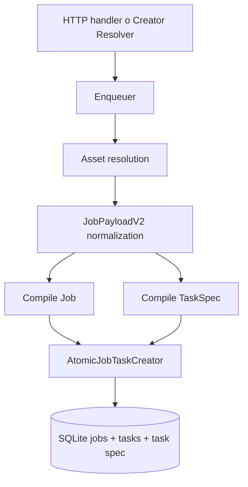
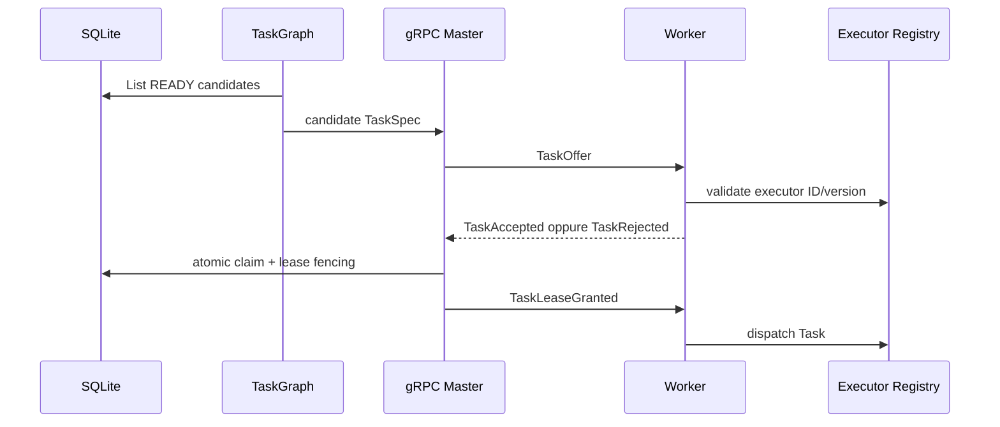

# Current architecture — Come funziona oggi

**Capitolo del perimetro architetturale Velox** — corrisponde alla **PARTE I** del documento indice [`CURRENT-TO-TARGET-ARCHITECTURE.md`](./CURRENT-TO-TARGET-ARCHITECTURE.md).  
**Stato:** descrittivo dello stato corrente verificabile su `main`.  
**Sezioni:** 6, 7, 8, 9, 10, 11, 12, 13, 15 (la sezione 14 — Supervisor e readiness — è trattata in [`failure-recovery.md`](./failure-recovery.md)).

---

## 6. Ingresso e compilazione Job

Il percorso video usa `shared/contract.JobPayloadV2`.

L'Enqueuer:

1. riceve il payload da un handler HTTP o dal creator resolver;
2. risolve voiceover e scene image;
3. normalizza il payload;
4. rimuove alias legacy dalle scritture canoniche;
5. determina identità e metadati;
6. compila `jobs.Job`;
7. compila `taskgraph.TaskSpec`;
8. delega a `AtomicJobTaskCreator`;
9. inserisce Job e primo Task nella stessa transazione.



### Identità normale

Per richieste normali il Job può ricevere un UUID.

### Identità forwarding

Per risultati provenienti da creatorflow:

```text
source_provider
source_job_id
target_executor_id
        ↓
routing.FormatForwardingKey
        ↓
enqueue.DeriveForwardingJobID
```

Webhook duplicati, poller concorrenti e retry post-crash convergono sullo stesso Job.

### Limite corrente

Il percorso video principale è ancora sostanzialmente:

```text
1 Job → 1 Task scene.composite.v1@1
```

Il Task contiene un payload completo che il worker tratta come composizione monolitica. TaskGraph esiste, ma il video standard non è ancora compilato in un vero DAG di Task granulari.

---

## 7. Job, Task e TaskAttempt

### Job

Rappresenta il risultato business richiesto dall'utente.

Stati essenziali:

```text
PENDING
RUNNING
RETRY_WAIT
SUCCEEDED
FAILED
CANCELLED
```

Il Job non deve possedere lease o worker assignment.

### Task

Rappresenta una unità schedulabile e possiede:

- dipendenze;
- stato READY/LEASED/RUNNING/terminal;
- executor ID/version;
- requisiti;
- attempt number;
- revision;
- worker e lease correnti.

### TaskAttempt

Rappresenta un'esecuzione concreta e possiede:

- worker;
- lease;
- risultato;
- metriche;
- timing di fase;
- output;
- motivo tipizzato;
- identità del tentativo vincente.

### Stato attuale

La codebase è migrata verso un modello Task-native:

- i vecchi messaggi Job del protocollo sono rimossi;
- il worker riceve TaskOffer e TaskLeaseGranted;
- i TaskResult sono tipizzati;
- l'ingestion service centralizza la chiusura del tentativo;
- metriche tipizzate e artifact registration sono collegate all'ingestion.

Resta obbligatorio mantenere test full-tree che impediscano nuove mutation laterali.

---

## 8. Placement e dispatch

Il master possiede il cost model.



Il worker non deve selezionare il lavoro tramite switch paralleli. Deve usare il registry.

Il composition root worker oggi:

- costruisce `executor.Registry`;
- costruisce il pipeline runner;
- esegue bootstrap fail-closed del motore C++ e di FFmpeg;
- registra `scene.composite.v1@1`;
- costruisce cache persistente e blob store;
- passa registry, cache e blob al runtime.

Questa è una base corretta.

Gap:

- catalogo executor reale ristretto;
- la pipeline completa passa principalmente da scene composite;
- cost, locality e multi-executor DAG non sono ancora dimostrati E2E;
- la certificazione per hardware class non è chiusa.

---

## 9. Esecuzione worker

```text
TaskLeaseGranted
    ↓
TaskRunner
    ↓
ExecutorRegistry.Resolve(executor_id, version)
    ↓
SceneComposite executor
    ↓
pipeline.Runner
    ↓
video engine C++ / FFmpeg
    ↓
output e metriche
    ↓
TaskResult tipizzato
```

Il worker deve:

- eseguire, non pianificare;
- rispettare il contratto;
- non inventare Task;
- non cambiare il DAG;
- non scegliere un executor alternativo;
- non dichiarare il Job riuscito;
- produrre hash, size, metadati e metriche.

Cache e blob locali sono ottimizzazioni ricostruibili, non autorità business.

---

## 10. Ingestion del TaskResult

Percorso canonico:

```text
gRPC handler
    ↓
TaskReportIngestionService
    ↓
transazione atomica:
    - chiusura TaskAttempt
    - aggiornamento Task
    - metriche tipizzate
    - cache/cost evidence
    - registrazione output
    ↓
completion/finalization
```

L'handler deve soltanto:

- validare protocollo e identità;
- tradurre gli errori in status gRPC;
- delegare al servizio.

Non deve ricreare la sequenza con SQL o repository separati.

---

## 11. Artifact e completion protocol

### DeclareOutputs

Il master:

- valida la FenceTuple;
- crea o riusa `attempt_commit`;
- genera un commit token deterministico HMAC;
- registra le dichiarazioni output;
- restituisce UploadPlan.

### RecordUploadProgress

Aggiorna:

- `last_progress_at`;
- deadline del commit;
- byte caricati.

Gap osservato: il contratto dichiara progress monotono, mentre la mutation corrente assegna il valore ricevuto. Un heartbeat vecchio può regredire `uploaded_bytes`.

Target SQL:

```sql
SET uploaded_bytes = MAX(uploaded_bytes, ?)
```

### CompleteUpload

Verifica:

- stato upload;
- hash worker;
- hash server-side;
- stato artifact;
- conteggio output ready.

Un artifact può diventare READY solo dopo verifica sufficiente.

### CommitAttempt

La transazione finale:

- marca TaskAttempt;
- marca Task;
- marca il commit COMMITTED;
- effettua il roll-up Job secondo il contratto canonico;
- crea delivery;
- inserisce outbox;
- legge CommitResult prima del commit SQL.

### Confine di ownership corrente

Il gate `TestSucceededWriterIsFinalizationOnly` è stato promosso a must-pass e ora passa.

`internal/completion/sqlite_uow.go` è considerato il gateway SQL autorizzato del Coordinator, nella stessa transazione atomica, non un writer business laterale.

La regola da preservare è:

- `artifacts.FinalizeVerified` governa la finalizzazione artifact/job del percorso artifact;
- `Coordinator.CommitAttempt` governa attempt/task/commit e il relativo roll-up atomico;
- nessun handler o runner può aggiungere un terzo percorso;
- nessun Job può diventare SUCCEEDED prima dell'evidenza artifact richiesta.

Resta utile rendere questa distinzione esplicita in ownership e nei test E2E, così l'allowlist del UoW non venga interpretata come permesso per nuovi writer.

---

## 12. Creatorflow e forwarding

Il polling volatile in goroutine è stato sostituito da `creator_forwardings` persistente.

Stati concettuali:

```text
PENDING
POLLING
RETRY_WAIT
READY_TO_FORWARD
FORWARDING
FORWARDED
BLOCKED
FAILED
```

### Runner

`CreatorForwardingRunner`:

1. reclama righe;
2. assegna lease;
3. avvia renewal;
4. interroga il creator remoto;
5. persiste failure, retry o risultato;
6. delega al Resolver;
7. crea Job+Task e marca FORWARDED atomicamente.

### Resolver

`creatorflow.Resolver`:

- verifica completezza;
- calcola forwarding key;
- deriva job ID deterministico;
- normalizza payload;
- riscrive URL quando necessario;
- assicura la forwarding row;
- prepara Job e TaskSpec;
- esegue `AtomicForwardAndEnqueue`.

La convergenza è corretta.

### Failure window ancora aperte

- `processLease` non restituisce errore;
- mutation failure possono essere solo loggate;
- `tick` può restituire `nil` senza transizione persistita;
- metriche possono aumentare prima della conferma DB;
- ClaimBatch può superare Concurrency;
- lease reclamate possono attendere il semaphore senza renewal;
- resolver lazy è condiviso tra goroutine;
- fast path "Job esistente" deve garantire repair della forwarding row.

Possibile falso successo:

```text
log = forwarded/retried/failed
metric = incrementata
SQLite = stato precedente
supervisor = runner sano
```

Questo è P0.

---

## 13. Outbox e delivery

```text
Transazione business
    ↓
outbox_event persistito
    ↓
OutboxDispatcher
    ↓
DeliveryRunner
    ↓
Provider Registry
    ↓
delivery terminale o retry durabile
```

Obblighi:

- replay idempotente;
- nessun evento perso;
- nessuna delivery duplicata;
- errori infrastrutturali propagati;
- retry tipizzati;
- backlog e oldest-age osservabili.

Outbox e delivery sono critical perché il server può restare vivo mentre il business flow è fermo.

---

## 15. CI corrente

Sono presenti:

- `make verify`;
- workspace tests;
- routing invariants;
- typed metrics must-pass;
- pre-existing test watchlist promossa a must-pass;
- altri gate architetturali e security.

### Stato aggiornato

I quattro test della vecchia watchlist ora passano deterministicamente:

- `TestSucceededWriterIsFinalizationOnly`;
- `TestBeginUpload_WrongAttemptStatus`;
- `TestUploadCompletedVideo_CanonicalPipeline`;
- `TestGenerateWithImages_UsesCreatorStageWhenConfigured`.

Il gap non è più "correggere quei quattro test". Il gap è:

- rendere il gate required nella branch protection;
- dimostrare una clean `make verify` completa;
- evitare duplicazione di build logic tra workflow;
- rendere CTest e workload E2E obbligatori;
- impedire skip silenziosi;
- pubblicare evidenza di release unica.

Target:

```text
make verify
    ├── formatting
    ├── architecture checks
    ├── migrations
    ├── Go vet/test/race
    ├── C++ configure/build/CTest
    ├── security checks
    ├── real workload E2E
    └── release evidence
```

I workflow devono essere dispatcher sottili.

> La sezione 14 (Supervisor e readiness) è trattata in [`failure-recovery.md`](./failure-recovery.md).
