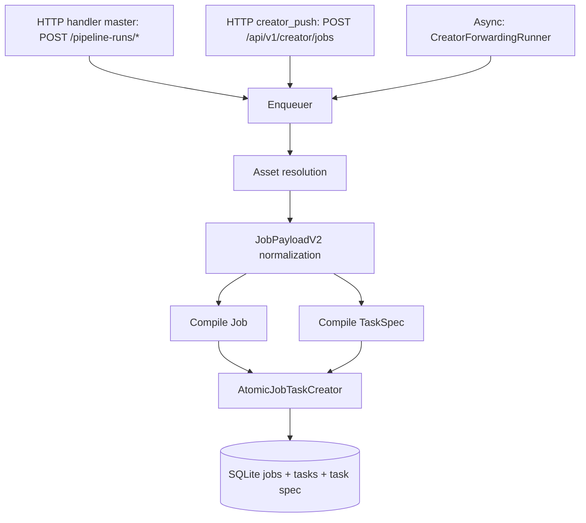
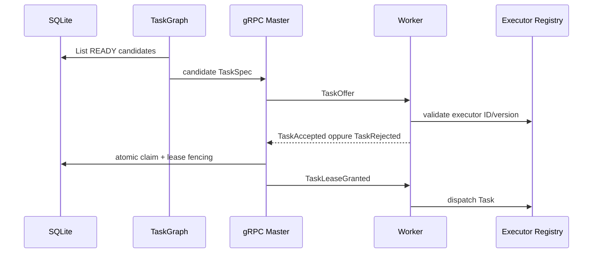
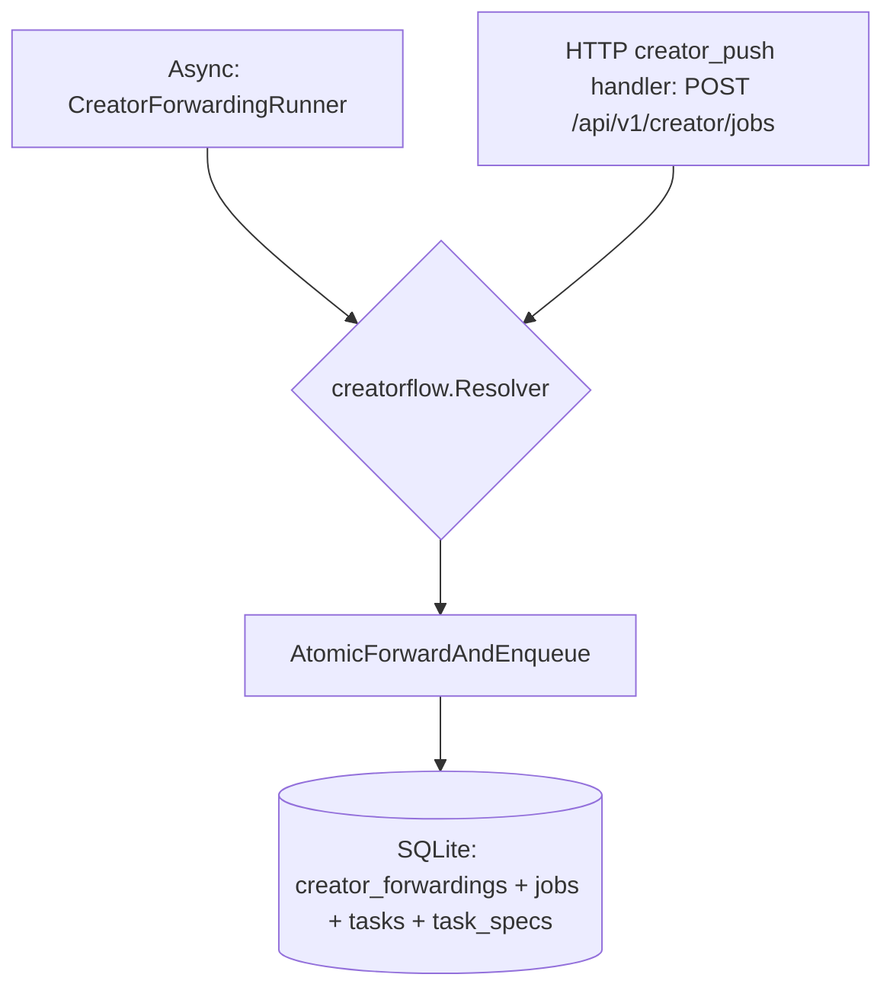

# Current architecture — Come funziona oggi

**Capitolo del perimetro architetturale Velox** — corrisponde alla **PARTE I** del documento indice [`CURRENT-TO-TARGET-ARCHITECTURE.md`](./CURRENT-TO-TARGET-ARCHITECTURE.md).  
**Stato:** descrittivo dello stato corrente verificabile su `main`.  
**Sezioni:** 6, 7, 8, 9, 10, 11, 12, 13, 15 (la sezione 14 — Supervisor e readiness — è trattata in [`failure-recovery.md`](./failure-recovery.md)).

---

## 6. Ingresso e compilazione Job

Il percorso video usa `shared/contract.JobPayloadV2`.

### 6.1 Confine canonico del payload

Il flusso canonico è una sequenza di sei confini logici. I confini
 descrivono l'ownership dei dati e non introducono un framework interno o un
nuovo modello di dominio. L'ordine temporale può avere due ingressi: il
risultato del remote engine passa dall'adapter prima di convergere nel
contratto; una richiesta HTTP già canonica passa direttamente dall'intake.

```text
HTTP request ──→ intake HTTP ───────────────┐
                                            ├─→ canonical contract
remote-engine response ──→ remote adapter ──┘   (JobPayloadV2 / DTO canonico)
                                                       ↓
                                                control plane
                                        (DeliveryPlan + PublicationSpecs)
                                                       ↓
                                            worker payload projection
                                                       ↓
                                             enqueue preparation
                                                       ↓
                                           Job + TaskSpec persistiti
                                                       ↓
                                                worker / renderer
```

Il **remote engine adapter** è quindi un confine di ingresso/proiezione, non
un passaggio successivo alla persistenza: `ParseRemotePipelineResult` e
`ToWorkerPayload` vengono usati dagli handler prima di `creatorflow.Resolver`
e dell'enqueue. La matrice seguente mantiene comunque tutti e sei i confini
espliciti per evitare che questa responsabilità venga duplicata.

La tabella seguente è la matrice di responsabilità operativa. Le colonne
**entra** e **esce** descrivono il confine, mentre **non possiede** rende
esplicite le responsabilità che non devono essere duplicate in quel livello.

| Confine | Implementazione/tipi esistenti | Entra | Esce | Possiede | Non possiede |
| --- | --- | --- | --- | --- | --- |
| **1. Intake HTTP** | `pipeline.SubmitJob`, `decodeStrictJSON`, `ValidateSubmitJobRequest`, `normalizeCreatorPushRequest` per il push creator | Body HTTP, header e autenticazione del producer | DTO di richiesta validato oppure `CanonicalCompletedPayload` | Decodifica stretta, validazione di forma, limiti HTTP, idempotency key e traduzione degli errori HTTP | Scritture SQL, risoluzione asset, stato Job/Task, payload finale del renderer |
| **2. Canonical contract** | `contract.JobPayloadV2`, `NewJobPayloadV2`, `(*JobPayloadV2).ToMap`, `pipeline.CanonicalCompletedPayload` | DTO/map già accettati dall'intake o risultato remoto | Forma tipizzata/canonica con identità, scene, asset e campi tecnici | Nomi canonici, versione del contratto, identità, shape di scene e payload; rifiuto/stripping degli alias nelle scritture canoniche | Binding HTTP, schema SQL, scelta del worker, metadata di pubblicazione |
| **3. Control plane** | `creatorflow.ResolveRequest`, `DeliveryPlan`, `publication.Spec`, `creatorflow.Resolver`, `PlanResolver` | Payload worker canonico più `DeliveryPlan` e `PublicationSpecs` separati | `TaskSpec.DeliveryPlan`, `TaskSpec.PublicationSpecs` e routing persistibile | Destinazioni, retry budget, priorità, metadata di delivery, publication intent, forwarding identity e transizioni atomiche | Scene rendering, composizione video, interpretazione di metadata social nel renderer |
| **4. Worker payload projection** | `projectWorkerPayload`, `submitRequestToRawPayload`, `remoteengine.RemotePipelineResult.ToWorkerPayload`, `stripRendererPublicationFields` | Input canonico o DTO remoto tipizzato | Map worker con `scenes_json`, asset tecnici, audio, output e campi di rendering | Proiezione controllata e compatibile per il renderer; rimozione di publication/delivery metadata; compatibilità legacy solo nella proiezione documentata | Destinazioni, `PublicationSpecs`, scheduling, retry delivery, scritture Job/Task |
| **5. Enqueue preparation** | `Enqueuer.PrepareJobAndTask`, `validateEnqueueInput`, `resolveEnqueueAssets`, `normalizeEnqueuePayload`, `projectEnqueueJobContext`, `persistEnqueueJobTask` | Payload worker/canonico e requisiti di scheduling | `jobs.Job` e `taskgraph.TaskSpec` pronti per `AtomicJobTaskCreator` | Ordine delle fasi validate → resolve assets → normalize → project → persist, identità forwarding deterministica, risoluzione asset e errori classificabili (`EnqueuePhase`) | Parsing HTTP, decisioni editoriali, reinterpretazione del contratto remoto, upload/delivery al provider |
| **6. Remote engine adapter** | `remoteengine.ValidateInitialResponse`, `ParseRemotePipelineResult`, `RemotePipelineResult`, `ToWorkerPayload` | Mappe di risposta del remote engine | DTO remoto validato e successiva proiezione worker | Validazione di status/job ID, conversione da map a DTO, estrazione scene/asset/audio e rimozione dei campi non renderer | Business policy del master, assegnazione destinazioni, persistenza, scelta di un executor alternativo |

#### Regole di attraversamento

1. **Un solo contratto canonico per l'esecuzione.** I producer possono avere
   envelope diversi, ma dopo l'intake devono convergere su
   `CanonicalCompletedPayload` e/o `JobPayloadV2`; non devono creare una
   seconda normalizzazione equivalente.
2. **Il control plane viaggia a fianco del payload renderer.**
   `DeliveryPlan` e `PublicationSpecs` sono argomenti/campi distinti di
   `ResolveRequest` e `TaskSpec`. Non vanno inseriti in `WorkerPayload`,
   `scenes_json` o `video_metadata`.
3. **Il renderer riceve una proiezione, non il progetto grezzo.**
   `ToWorkerPayload` è il punto in cui il risultato remoto viene convertito
   in input worker. `stripRendererPublicationFields` deve restare applicato
   dopo gli overlay tipizzati, così i campi di controllo non possono
   rientrare tramite una risposta legacy.
4. **L'enqueue non reinterpreta il dominio remoto.** Prepara asset, identità,
   requisiti e `TaskSpec`; non deve diventare un secondo HTTP handler o un
   secondo adapter remote-engine.
5. **Gli alias legacy sono fallback di lettura, non output canonico.**
   `NewJobPayloadV2` può leggere alias dalle righe/forme legacy compatibili,
   mentre `JobPayloadV2.ToMap()` produce la forma V2 e li rimuove dall'output.
   Eventuali compatibilità devono restare confinate a letture/proiezioni
   documentate e non reintrodurre `parameters`, `id`, `run_id`, `title`,
   `voiceover_path` o `audio_path` nelle nuove scritture.
6. **Persistenza e ownership restano atomiche.** Il Resolver prepara il
   payload e passa `Job`, `TaskSpec`, delivery plan e publication specs a
   `AtomicForwardAndEnqueue`; gli handler non aprono writer paralleli.

#### Confini di esclusione per i dati

| Dato | Intake/contract | Control plane | Worker payload | Enqueue/TaskSpec |
| --- | --- | --- | --- | --- |
| Scene text, timeline e asset tecnici | valida e canonizza | non possiede | **sì**, nella forma necessaria al renderer | risolve riferimenti e compila |
| `video_metadata` tecnico (codec, dimensioni, audio) | valida shape | non possiede | **sì**, solo campi renderer-owned | persiste solo se richiesto dal TaskSpec |
| Publication title/description/tags/privacy | può ricevere e normalizzare | **sì** (`publication.Spec`) | **mai** | persiste come publication intent, non come scena |
| Destinazioni e `delivery_plan` | valida forma | **sì** | **mai** | persiste in `TaskSpec.DeliveryPlan`/piano delivery |
| Retry budget e priorità delivery | valida forma | **sì** | **mai** | applica precondizioni e compila il task |
| Forwarding identity | decodifica/propaga | **sì** per dedup e transizioni | solo il riferimento tecnico necessario | deriva il `job_id` deterministico |

Questa matrice è descrittiva dello stato corrente su `main`. Se un futuro
cambiamento richiede un nuovo tipo o un nuovo passaggio, deve prima
identificare quale riga della matrice possiede la responsabilità e dimostrare
una duplicazione reale; non si aggiungono astrazioni generiche soltanto per
rappresentare il diagramma.

---

### 6.2 Percorsi di intake esistenti

Il percorso video usa `shared/contract.JobPayloadV2`.

L'Enqueuer riceve il payload da uno dei tre percorsi di intake canonici:

1. un handler HTTP del flusso master (`POST /api/v1/pipeline-runs/*`);
2. il polling asincrono del `CreatorForwardingRunner` (vedi §12);
3. l'intake HTTP diretto `POST /api/v1/creator/jobs` (handler `creator_push`, autenticato via bearer `VELOX_ADMIN_TOKEN` nello stesso gruppo di route della pipeline) — vedi §12 per il dettaglio dei due percorsi creator.

In tutti i casi l'Enqueuer:

1. risolve voiceover e scene image;
2. normalizza il payload;
3. rimuove alias legacy dalle scritture canoniche;
4. determina identità e metadati;
5. compila `jobs.Job`;
6. compila `taskgraph.TaskSpec`;
7. delega a `AtomicJobTaskCreator`;
8. inserisce Job e primo Task nella stessa transazione.

Per i payload provenienti da un creator, la conversione al DTO tipizzato `RemotePipelineResult` avviene nell'handler (prima della delega all'Enqueuer) e non nell'Enqueuer stesso; vedi `docs/CREATOR-PUSH.md` per il dettaglio del contratto.

Tutti i percorsi di intake creator (asincrono via `CreatorForwardingRunner` e sincrono via `POST /api/v1/creator/jobs`) convergono su `creatorflow.Resolver` e quindi su `AtomicForwardAndEnqueue`; nessun handler introduce un secondo writer sul database (vedi §4.2 di `runtime-invariants.md`).


```mermaid
flowchart TD
    A1[HTTP handler master: POST /pipeline-runs/*] --> B[Enqueuer]
    A2[HTTP creator_push: POST /api/v1/creator/jobs] --> B
    A3[Async: CreatorForwardingRunner] --> B
    B --> C[Asset resolution]
    C --> D[JobPayloadV2 normalization]
    D --> E[Compile Job]
    D --> F[Compile TaskSpec]
    E --> G[AtomicJobTaskCreator]
    F --> G
    G --> H[(SQLite jobs + tasks + task spec)]
```

### Identità normale

Per richieste normali il Job può ricevere un UUID.

### Identità forwarding

Per risultati provenienti da creatorflow:

```text
source_provider
source_job_id
target_executor_id
        ↓
routing.FormatForwardingKey
        ↓
enqueue.DeriveForwardingJobID
```

Webhook duplicati, poller concorrenti e retry post-crash convergono sullo stesso Job.

### Limite corrente

Il percorso video principale è ancora sostanzialmente:

```text
1 Job → 1 Task scene.composite.v1@1
```

Il Task contiene un payload completo che il worker tratta come composizione monolitica. TaskGraph esiste, ma il video standard non è ancora compilato in un vero DAG di Task granulari.

---

## 7. Job, Task e TaskAttempt

### Job

Rappresenta il risultato business richiesto dall'utente.

Stati essenziali:

```text
PENDING
RUNNING
RETRY_WAIT
SUCCEEDED
FAILED
CANCELLED
```

Il Job non deve possedere lease o worker assignment.

### Task

Rappresenta una unità schedulabile e possiede:

- dipendenze;
- stato READY/LEASED/RUNNING/terminal;
- executor ID/version;
- requisiti;
- attempt number;
- revision;
- worker e lease correnti.

### TaskAttempt

Rappresenta un'esecuzione concreta e possiede:

- worker;
- lease;
- risultato;
- metriche;
- timing di fase;
- output;
- motivo tipizzato;
- identità del tentativo vincente.

### Stato attuale

La codebase è migrata verso un modello Task-native:

- i vecchi messaggi Job del protocollo sono rimossi;
- il worker riceve TaskOffer e TaskLeaseGranted;
- i TaskResult sono tipizzati;
- l'ingestion service centralizza la chiusura del tentativo;
- metriche tipizzate e artifact registration sono collegate all'ingestion.

Resta obbligatorio mantenere test full-tree che impediscano nuove mutation laterali.

---

## 8. Placement e dispatch

Il master possiede il cost model.


```mermaid
sequenceDiagram
    participant DB as SQLite
    participant TG as TaskGraph
    participant GRPC as gRPC Master
    participant W as Worker
    participant R as Executor Registry

    TG->>DB: List READY candidates
    TG->>GRPC: candidate TaskSpec
    GRPC->>W: TaskOffer
    W->>R: validate executor ID/version
    W-->>GRPC: TaskAccepted oppure TaskRejected
    GRPC->>DB: atomic claim + lease fencing
    GRPC->>W: TaskLeaseGranted
    W->>R: dispatch Task
```

Il worker non deve selezionare il lavoro tramite switch paralleli. Deve usare il registry.

Il composition root worker oggi:

- costruisce `executor.Registry`;
- costruisce il pipeline runner;
- esegue bootstrap fail-closed del motore C++ e di FFmpeg;
- registra `scene.composite.v1@1`;
- costruisce cache persistente e blob store;
- passa registry, cache e blob al runtime.

Questa è una base corretta.

Gap:

- catalogo executor reale ristretto;
- la pipeline completa passa principalmente da scene composite;
- cost, locality e multi-executor DAG non sono ancora dimostrati E2E;
- la certificazione per hardware class non è chiusa.

---

## 9. Esecuzione worker

```text
TaskLeaseGranted
    ↓
TaskRunner
    ↓
ExecutorRegistry.Resolve(executor_id, version)
    ↓
SceneComposite executor
    ↓
pipeline.Runner
    ↓
video engine C++ / FFmpeg
    ↓
output e metriche
    ↓
TaskResult tipizzato
```

Il worker deve:

- eseguire, non pianificare;
- rispettare il contratto;
- non inventare Task;
- non cambiare il DAG;
- non scegliere un executor alternativo;
- non dichiarare il Job riuscito;
- produrre hash, size, metadati e metriche.

Cache e blob locali sono ottimizzazioni ricostruibili, non autorità business.

---

## 10. Ingestion del TaskResult

Percorso canonico:

```text
gRPC handler
    ↓
TaskReportIngestionService
    ↓
transazione atomica:
    - chiusura TaskAttempt
    - aggiornamento Task
    - metriche tipizzate
    - cache/cost evidence
    - registrazione output
    ↓
completion/finalization
```

L'handler deve soltanto:

- validare protocollo e identità;
- tradurre gli errori in status gRPC;
- delegare al servizio.

Non deve ricreare la sequenza con SQL o repository separati.

---

## 11. Artifact e completion protocol

### DeclareOutputs

Il master:

- valida la FenceTuple;
- crea o riusa `attempt_commit`;
- genera un commit token deterministico HMAC;
- registra le dichiarazioni output;
- restituisce UploadPlan.

### RecordUploadProgress

Aggiorna:

- `last_progress_at`;
- deadline del commit;
- byte caricati.

Gap osservato: il contratto dichiara progress monotono, mentre la mutation corrente assegna il valore ricevuto. Un heartbeat vecchio può regredire `uploaded_bytes`.

Target SQL:

```sql
SET uploaded_bytes = MAX(uploaded_bytes, ?)
```

### CompleteUpload

Verifica:

- stato upload;
- hash worker;
- hash server-side;
- stato artifact;
- conteggio output ready.

Un artifact può diventare READY solo dopo verifica sufficiente.

### CommitAttempt

La transazione finale:

- marca TaskAttempt;
- marca Task;
- marca il commit COMMITTED;
- effettua il roll-up Job secondo il contratto canonico;
- crea delivery;
- inserisce outbox;
- legge CommitResult prima del commit SQL.

### Confine di ownership corrente

Il gate `TestSucceededWriterIsFinalizationOnly` è stato promosso a must-pass e ora passa.

`internal/completion/sqlite_uow.go` è considerato il gateway SQL autorizzato del Coordinator, nella stessa transazione atomica, non un writer business laterale.

La regola da preservare è:

- `artifacts.FinalizeVerified` governa la finalizzazione artifact/job del percorso artifact;
- `Coordinator.CommitAttempt` governa attempt/task/commit e il relativo roll-up atomico;
- nessun handler o runner può aggiungere un terzo percorso;
- nessun Job può diventare SUCCEEDED prima dell'evidenza artifact richiesta.

Resta utile rendere questa distinzione esplicita in ownership e nei test E2E, così l'allowlist del UoW non venga interpretata come permesso per nuovi writer.

---

## 12. Creatorflow e forwarding

Il polling volatile in goroutine è stato sostituito da `creator_forwardings` persistente.

Stati concettuali:

```text
PENDING
POLLING
RETRY_WAIT
READY_TO_FORWARD
FORWARDING
FORWARDED
BLOCKED
FAILED
```

Questi stati si applicano alla riga `creator_forwardings` indipendentemente dal percorso di intake che l'ha generata (vedi "Due percorsi di intake" più sotto).

### Due percorsi di intake, un solo writer

I payload provenienti da macchine Creator possono entrare nel sistema attraverso due percorsi distinti, entrambi destinati al medesimo `creatorflow.Resolver` e quindi allo stesso `AtomicForwardAndEnqueue`:

1. **Polling asincrono** — `CreatorForwardingRunner` interroga il creator remoto, persiste una riga in `creator_forwardings` e, quando il job remoto risulta `completed`, delega al Resolver. Questo è il flusso master-driven descritto sopra.

2. **Push sincrono** — la macchina Creator invia il payload già pronto via `POST /api/v1/creator/jobs` (autenticato tramite bearer `VELOX_ADMIN_TOKEN` nello stesso gruppo di route della pipeline). Il handler `creator_push` converte il payload nel DTO tipizzato `RemotePipelineResult` e lo passa al medesimo `creatorflow.Resolver`. Questo è il flusso Creator-driven, introdotto accanto al precedente per abilitare un intake diretto senza polling master. Il contratto HTTP è documentato in `docs/CREATOR-PUSH.md`.


```mermaid
flowchart TD
    A1[Async: CreatorForwardingRunner] --> R{creatorflow.Resolver}
    A2[HTTP creator_push handler: POST /api/v1/creator/jobs] --> R
    R --> E[AtomicForwardAndEnqueue]
    E --> F[(SQLite: creator_forwardings + jobs + tasks + task_specs)]
```

**Invariante "un solo writer" (riferimento: `runtime-invariants.md §4.2`).** Il push handler `creator_push` non apre transazioni proprie su SQLite e non duplica lo schema di `creator_forwardings`, `jobs` o `tasks`. L'unica transazione che materializza lo stato business è quella aperta da `AtomicForwardAndEnqueue`, lo stesso UoW già utilizzato dal `CreatorForwardingRunner`. I due intake sono quindi due **vie di accesso** alla medesima macchina canonica, non due writer paralleli.

**Callout — il Resolver è l'unico writer.** Il `creatorflow.Resolver` è il solo componente che apre transazioni di mutazione su `creator_forwardings`/`jobs`/`tasks` (via `AtomicForwardAndEnqueue`). Sia il `CreatorForwardingRunner` (intake asincrono) sia il push handler `creator_push` (intake sincrono) convergono su questa unica macchina canonica: nessuno dei due è un writer indipendente, sono due vie di accesso alla stessa transazione.

L'identità canonica `(source_provider, source_job_id, target_executor_id)` (vedi `docs/CREATOR-PUSH.md`) produce un `job_id` deterministico: replay, retry post-crash, poller concorrenti e webhook duplicati convergono sullo stesso forwarding e sullo stesso job Velox indipendentemente dal percorso di intake che li ha generati.

### Runner

`CreatorForwardingRunner`:

1. reclama righe;
2. assegna lease;
3. avvia renewal;
4. interroga il creator remoto;
5. persiste failure, retry o risultato;
6. delega al Resolver;
7. crea Job+Task e marca FORWARDED atomicamente.

### Resolver

`creatorflow.Resolver`:

- verifica completezza;
- calcola forwarding key;
- deriva job ID deterministico;
- normalizza payload;
- riscrive URL quando necessario;
- assicura la forwarding row;
- prepara Job e TaskSpec;
- esegue `AtomicForwardAndEnqueue`.

La convergenza è corretta.

### Failure window ancora aperte

- `processLease` non restituisce errore;
- mutation failure possono essere solo loggate;
- `tick` può restituire `nil` senza transizione persistita;
- metriche possono aumentare prima della conferma DB;
- ClaimBatch può superare Concurrency;
- lease reclamate possono attendere il semaphore senza renewal;
- resolver lazy è condiviso tra goroutine;
- fast path "Job esistente" deve garantire repair della forwarding row.

Possibile falso successo:

```text
log = forwarded/retried/failed
metric = incrementata
SQLite = stato precedente
supervisor = runner sano
```

Questo è P0.

---

## 13. Outbox e delivery

```text
Transazione business
    ↓
outbox_event persistito
    ↓
OutboxDispatcher
    ↓
DeliveryRunner
    ↓
Provider Registry
    ↓
delivery terminale o retry durabile
```

Obblighi:

- replay idempotente;
- nessun evento perso;
- nessuna delivery duplicata;
- errori infrastrutturali propagati;
- retry tipizzati;
- backlog e oldest-age osservabili.

Outbox e delivery sono critical perché il server può restare vivo mentre il business flow è fermo.

---

## 15. CI corrente

Sono presenti:

- `make verify`;
- workspace tests;
- routing invariants;
- typed metrics must-pass;
- pre-existing test watchlist promossa a must-pass;
- altri gate architetturali e security.

### Stato aggiornato

I quattro test della vecchia watchlist ora passano deterministicamente:

- `TestSucceededWriterIsFinalizationOnly`;
- `TestBeginUpload_WrongAttemptStatus`;
- `TestUploadCompletedVideo_CanonicalPipeline`;
- `TestGenerateWithImages_UsesCreatorStageWhenConfigured`.

Il gap non è più "correggere quei quattro test". Il gap è:

- rendere il gate required nella branch protection;
- dimostrare una clean `make verify` completa;
- evitare duplicazione di build logic tra workflow;
- rendere CTest e workload E2E obbligatori;
- impedire skip silenziosi;
- pubblicare evidenza di release unica.

Target:

```text
make verify
    ├── formatting
    ├── architecture checks
    ├── migrations
    ├── Go vet/test/race
    ├── C++ configure/build/CTest
    ├── security checks
    ├── real workload E2E
    └── release evidence
```

I workflow devono essere dispatcher sottili.

> La sezione 14 (Supervisor e readiness) è trattata in [`failure-recovery.md`](./failure-recovery.md).
