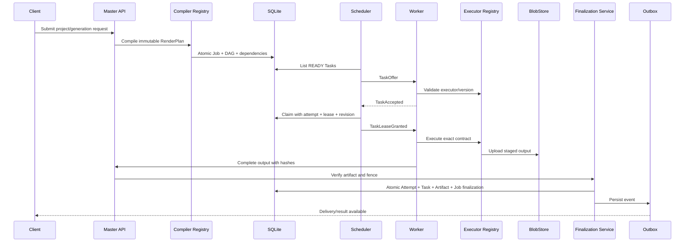

# Target architecture — Architettura target

**Capitolo del perimetro architetturale Velox** — corrisponde alla **PARTE II** del documento indice [`CURRENT-TO-TARGET-ARCHITECTURE.md`](./CURRENT-TO-TARGET-ARCHITECTURE.md).  
**Stato:** specifica dell'architettura obiettivo. Le sezioni 18 e 19 (multi-Task DAG e scheduler target) sono riprese e contestualizzate in [`distributed-rendering-roadmap.md`](./distributed-rendering-roadmap.md) sotto il profilo della roadmap di implementazione P2.

---

## 16. Flusso end-to-end definitivo



Invariante principale:

```text
Task richiesti terminali e validi
AND winning attempt inequivocabile
AND artifact finale presente
AND hash verificato
AND artifact READY
AND finalizzazione/outbox commit-tati
    ↓
Job SUCCEEDED
```

---

## 17. RenderPlan immutabile

Target:

```text
Endpoint specifico
    ↓
Compiler registrato
    ↓
RenderPlan comune e versionato
    ↓
TaskSpec derivati
    ↓
Executor generici
```

RenderPlan deve includere:

- schema version;
- identità deterministica;
- input canonici;
- timeline e layer;
- asset reference;
- output contract;
- codec, color, frame rate e time base;
- executor e versioni;
- requisiti;
- dipendenze;
- policy determinismo/cache.

Il worker non deve interpretare il progetto grezzo o decidere come dividerlo.

---

## 18. Multi-Task DAG

Esempio target:

```text
Job
 ├── prepare.asset.voiceover
 ├── prepare.asset.images
 ├── render.text
 ├── render.overlay
 ├── render.precomposition.A
 ├── render.precomposition.B
 ├── mix.audio
 ├── compose.scene
 ├── concat.video
 └── encode.final
```

Ogni Task deve avere:

- ID stabile;
- executor ID/version;
- input artifact;
- output atteso;
- requirements;
- dependency edges;
- retry policy;
- determinism/cache policy;
- state machine persistente.

Il DAG deve essere pubblicato atomicamente o restare non eseguibile finché la compilazione non è completa e validata.

> La roadmap di implementazione di questo DAG (fase P2) è descritta in [`distributed-rendering-roadmap.md`](./distributed-rendering-roadmap.md).

---

## 19. Scheduler target

Filtri:

1. executor ID/version;
2. resource class;
3. temporal mode;
4. deterministic requirement;
5. cacheable requirement;
6. slot disponibili;
7. memoria e disco;
8. drain/readiness;
9. banda;
10. locality e cache evidence.

Score:

```text
priority
+ queue age
+ estimated completion time
+ locality
+ bandwidth
+ historical profile
- pressure
- transfer cost
- fairness penalty
```

La decisione deve essere persistita e spiegabile.

> L'evoluzione del cost model e dello scheduling locality-aware è parte del P2 trattato in [`distributed-rendering-roadmap.md`](./distributed-rendering-roadmap.md).

---

## 20. Cache e artifact target

### Cache hit valida

- key da input semantici canonici;
- executor/engine version inclusi;
- nessun path macchina o timestamp casuale;
- blob presente;
- hash verificato;
- metadati compatibili.

### Artifact states

```text
DECLARED
STAGING
VERIFYING
READY
QUARANTINED
FAILED
```

Nessun path locale worker diventa output finale senza registrazione master.

### Finalizzazione

Deve restare un solo confine business autorizzato a:

- scegliere il winning attempt;
- verificare output;
- promuovere artifact;
- marcare Task e Job;
- creare outbox/delivery;
- restituire risultato idempotente.

Adapter SQL e Unit of Work sono dettagli interni del medesimo confine, non nuovi owner.

---

## 21. Recovery target

### Master restart

- readiness falsa;
- dipendenze validate;
- runner avviati;
- Task READY riletti;
- lease scadute riconciliate;
- outbox/delivery riprese;
- forwardings ripresi;
- upload/artifact abbandonati riconciliati;
- readiness vera solo dopo probe reali.

### Worker crash

- renewal mancante;
- lease scaduta;
- vecchio attempt stale/terminal;
- un solo nuovo attempt;
- Task READY o FAILED;
- late result rifiutato;
- un solo artifact finale READY.

### Network partition

- nessuna split-brain finalization;
- nuova sessione autenticata;
- replay idempotente;
- lease/revision proteggono il winner;
- reason tipizzati.

> La suite di test che deve garantire queste garanzie (P1-03) è descritta in [`failure-recovery.md`](./failure-recovery.md).
